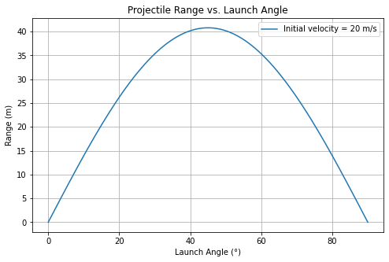
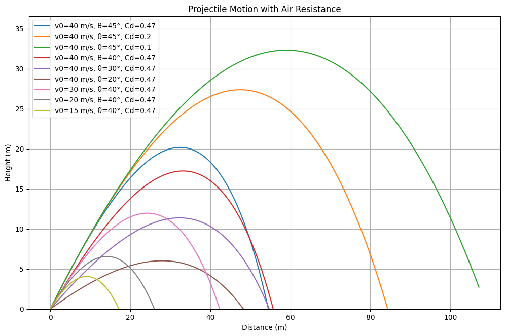

# Problem 1

# **Projectile Motion Analysis and Simulation**

### **Investigating the Range as a Function of the Angle of Projection**

---

## **1. Theoretical Foundation**

Projectile motion follows Newton’s laws of motion. We analyze the motion by separating it into horizontal and vertical components.

### **1.1 Equations of Motion**

The motion of a projectile launched with initial velocity \( v_0 \) at an angle \( \theta \) is governed by:

- **Horizontal motion (constant velocity)**
  $$
  x = v_0 \cos(\theta) t
  $$
- **Vertical motion (accelerated due to gravity)**
  $$
  y = v_0 \sin(\theta) t - \frac{1}{2} g t^2
  $$
- **Time of flight (when \( y = 0 \))**
  $$
  t_f = \frac{2 v_0 \sin(\theta)}{g}
  $$
- **Range of projectile**
  $$
  R = \frac{v_0^2 \sin(2\theta)}{g}
  $$
- **Maximum height**
  $$
  H = \frac{v_0^2 \sin^2(\theta)}{2g}
  $$

### **1.2 Effects of Air Resistance**

Without air resistance, projectiles follow a **parabolic trajectory**. However, with air resistance, the motion is more complex because drag opposes velocity. The drag force is given by:

$$
F_d = \frac{1}{2} C_d \rho A v^2
$$

where:

- \( C_d \) = drag coefficient (depends on object shape)
- \( \rho \) = air density (kg/m³)
- \( A \) = cross-sectional area (m²)
- \( v \) = velocity (m/s)

The equations of motion then become **nonlinear differential equations**, which we solve numerically.

---

## **2. Analytical Analysis of Range**

This section plots **range vs. launch angle** without air resistance.

---

## **3. Numerical Simulation with Air Resistance**

Here, we use **ODE solvers** to simulate projectile motion with drag.

---

## **4. Interactive Simulation**

This section adds [sliders](https://colab.research.google.com/drive/1GlJbqtlKH8E3AgUMlgDzl-D4lrUWxCb5) for interactive tuning of launch parameters.
