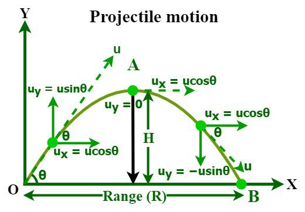
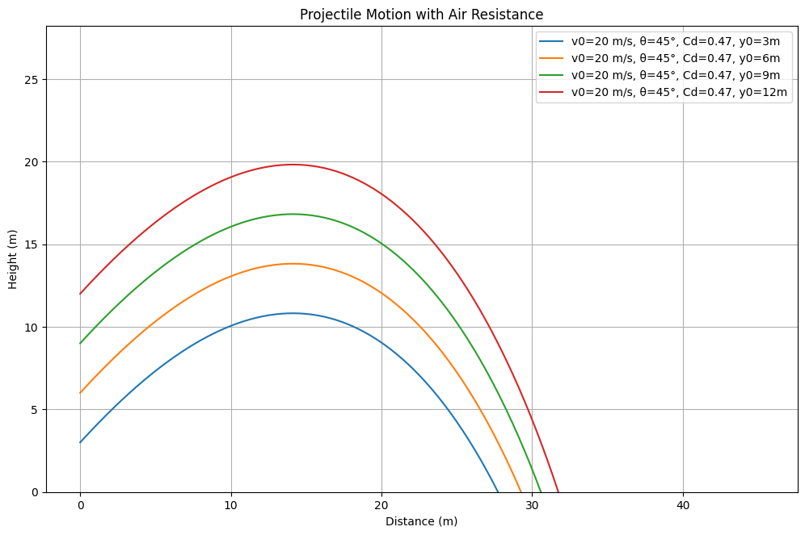

# Problem 1

# **Projectile Motion Analysis and Simulation**

### **Investigating the Range as a Function of the Angle of Projection**

---

## **1. Theoretical Foundation**

Projectile motion is a fundamental topic in classical mechanics, describing the motion of an object launched into the air under the influence of gravity. It plays a crucial role in various real-world applications, such as ballistics, sports, and space exploration. Understanding projectile motion requires analyzing both horizontal and vertical components independently, assuming no external forces except gravity (neglecting air resistance initially). By exploring its equations, derivations, and computational approaches, we can gain deeper insights into the factors influencing projectile trajectory.



### **1.1 Equations of Motion**

The motion of a projectile launched with an initial velocity \( v_0 \) at an angle \( \theta \) is governed by the fundamental kinematic equations.

#### **1.1.1 Horizontal Motion**

Since there is no horizontal acceleration (neglecting air resistance), the horizontal displacement is given by:

\[ x = v_0 \cos(\theta) t \]

where:

- \( x \) = horizontal displacement
- \( v_0 \) = initial velocity
- \( \theta \) = launch angle
- \( t \) = time

#### **1.1.2 Vertical Motion**

The vertical motion is influenced by gravity \( g \), leading to the equation:

\[ y = v_0 \sin(\theta) t - \frac{1}{2} g t^2 \]

where:

- \( y \) = vertical displacement
- \( g \) = acceleration due to gravity (9.81 m/s²)

### **1.2 Derivation of Key Equations**

#### **1.2.1 Time of Flight**

The total time of flight occurs when the projectile returns to the ground (i.e., \( y = 0 \)). Setting the vertical displacement equation to zero:

\[ 0 = v_0 \sin(\theta) t - \frac{1}{2} g t^2 \]

Factoring out \( t \):

\[ t (v_0 \sin(\theta) - \frac{1}{2} g t) = 0 \]

Solving for \( t \):

\[ t_f = \frac{2 v_0 \sin(\theta)}{g} \]

#### **1.2.2 Range of the Projectile**

The range \( R \) is the horizontal distance traveled before the projectile lands:

\[ R = v_0 \cos(\theta) t_f \]

Substituting \( t_f \) from above:

\[ R = v_0 \cos(\theta) \times \frac{2 v_0 \sin(\theta)}{g} \]

Using the trigonometric identity \( 2 \sin(\theta) \cos(\theta) = \sin(2\theta) \), we get:

\[ R = \frac{v_0^2 \sin(2\theta)}{g} \]

#### **1.2.3 Maximum Height**

At the peak, the vertical velocity is zero \( (v_y = 0) \). Using the kinematic equation:

\[ v_y^2 = v_0^2 \sin^2(\theta) - 2 g H \]

Setting \( v_y = 0 \):

\[ 0 = v_0^2 \sin^2(\theta) - 2 g H \]

Solving for \( H \):

\[ H = \frac{v_0^2 \sin^2(\theta)}{2g} \]

### **1.3 Effects of Air Resistance**

Without air resistance, projectiles follow a **parabolic trajectory**. However, with air resistance, the motion becomes more complex due to a drag force \( F_d \), given by:

\[ F_d = \frac{1}{2} C_d \rho A v^2 \]

where:

- \( C_d \) = drag coefficient (depends on object shape)
- \( \rho \) = air density (kg/m³)
- \( A \) = cross-sectional area (m²)
- \( v \) = velocity (m/s)

The velocity \( v \) is the magnitude of the velocity vector, given by:

\[ v = \sqrt{v_x^2 + v_y^2} \]

The drag force acts in the direction opposite to motion, so it affects both the horizontal and vertical components separately.

---

### **1.4 Numerical Computation with Air Resistance**

With air resistance, the equations of motion become nonlinear differential equations. Below, we derive the horizontal and vertical components.

#### **1.4.1 Horizontal Motion with Drag**

Newton’s Second Law states:

\[ F_x = m \frac{dv_x}{dt} \]

Since the only force acting in the horizontal direction is the drag force:

\[ - F_d \cos \theta = m \frac{dv_x}{dt} \]

where \( \theta \) is the angle of the velocity vector. Substituting \( F_d \):

\[ - \frac{1}{2} C_d \rho A v^2 \cos \theta = m \frac{dv_x}{dt} \]

Since \( \cos \theta = \frac{v_x}{v} \), we obtain:

\[ m \frac{dv_x}{dt} = -\frac{1}{2} C_d \rho A v v_x \]

#### **1.4.2 Vertical Motion with Drag**

Applying Newton’s Second Law in the vertical direction:

\[ F_y = m \frac{dv_y}{dt} \]

The forces in the vertical direction are gravity and drag:

\[ - mg - F_d \sin \theta = m \frac{dv_y}{dt} \]

Substituting \( F_d \):

\[ - mg - \frac{1}{2} C_d \rho A v^2 \sin \theta = m \frac{dv_y}{dt} \]

Since \( \sin \theta = \frac{v_y}{v} \), we get:

\[ m \frac{dv_y}{dt} = -mg - \frac{1}{2} C_d \rho A v v_y \]

These coupled differential equations require numerical methods such as Euler’s method or Runge-Kutta to solve for projectile motion with air resistance.

### **1.5 Summary of Important Equations**

| Quantity            | Equation                                         |
| ------------------- | ------------------------------------------------ |
| Horizontal Position | \( x = v_0 \cos(\theta) t \)                     |
| Vertical Position   | \( y = v_0 \sin(\theta) t - \frac{1}{2} g t^2 \) |
| Time of Flight      | \( t_f = \frac{2 v_0 \sin(\theta)}{g} \)         |
| Range               | \( R = \frac{v_0^2 \sin(2\theta)}{g} \)          |
| Maximum Height      | \( H = \frac{v_0^2 \sin^2(\theta)}{2g} \)        |
| Drag Force          | \( F_d = \frac{1}{2} C_d \rho A v^2 \)           |

---

## **2. Analytical Analysis of Range**

This section plots **range vs. launch angle** without air resistance. <a href="https://colab.research.google.com/drive/1sxZ0hmVo9KCmVdGBfbu7JuImuAKgUyYd#scrollTo=70QY0plaFcA-" target="_blank">Learn more.</a>


```python
import numpy as np
import matplotlib.pyplot as plt

# Constants
g = 9.81  # gravitational acceleration (m/s²)
v0 = 10   # initial velocity (m/s)

# Angle range (0° to 90°)
theta = np.linspace(0, 90, 100)
theta_rad = np.radians(theta)  # Convert to radians

# Compute range
R = (v0**2 * np.sin(2 * theta_rad)) / g

# Plot range vs. angle
plt.figure(figsize=(12, 7.5))
plt.plot(theta, R, label=f'Initial velocity = {v0} m/s')
plt.xlabel('Launch Angle (°)')
plt.ylabel('Range (m)')
plt.title('Projectile Range vs. Launch Angle')
plt.legend()
plt.grid()
plt.show()
```

---

## **3. Numerical Simulation with Air Resistance**

Here, we use **ODE solvers** to simulate projectile motion with drag. <a href="https://colab.research.google.com/drive/1mVflU6NC26PCAmQeVa732XKLAykqwTBU#scrollTo=Z3YGY0DjGQv-" target="_blank">Learn more.</a>


```python
import numpy as np
import matplotlib.pyplot as plt
from scipy.integrate import solve_ivp

# Constants
g = 9.81  # Gravity (m/s²)
rho = 1.225  # Air density (kg/m³)
Cd = 0.47  # Drag coefficient (sphere)
A = 0.01  # Cross-sectional area (m²)
m = 0.145  # Mass of projectile (kg) (e.g., baseball)

def equations(t, state, Cd, A, m, rho):
    """Differential equations for projectile motion with air resistance."""
    x, y, vx, vy = state
    v = np.sqrt(vx**2 + vy**2)  # Speed
    drag = (0.5 * Cd * rho * A * v**2) / m  # Drag acceleration

    ax = -drag * (vx / v)  # Drag in x-direction
    ay = -g - drag * (vy / v)  # Drag in y-direction

    return [vx, vy, ax, ay]

def solve_projectile(v0, theta_deg, Cd=0.47):
    """Solve projectile motion with air resistance using numerical integration."""
    theta = np.radians(theta_deg)
    vx0 = v0 * np.cos(theta)
    vy0 = v0 * np.sin(theta)

    # Initial conditions
    state0 = [0, 0, vx0, vy0]

    # Solve using solve_ivp
    t_span = (0, 5)  # Time range
    t_eval = np.linspace(0, 5, 300)  # Time points for solution
    sol = solve_ivp(equations, t_span, state0, t_eval=t_eval, args=(Cd, A, m, rho))

    return sol.t, sol.y[0], sol.y[1]  # Time, x, y

def plot_trajectory(arr_args):
    """Plots projectile motion with adjustable parameters."""

    plt.figure(figsize=(12, 7.5))
    for item in arr_args:
        v0, theta_deg, Cd = item
        t, x, y = solve_projectile(v0, theta_deg, Cd)
        plt.plot(x, y, label=f'v0={v0} m/s, θ={theta_deg}°, Cd={Cd}')
    plt.xlabel('Distance (m)')
    plt.ylabel('Height (m)')
    plt.title('Projectile Motion with Air Resistance')
    plt.legend()
    plt.grid()
    plt.ylim(0)  # Ensure ground level is visible
    plt.show()

# Example Plot
plot_trajectory([(40, 45, 0.47), (40, 45, 0.2), (40, 45, 0.1), (40, 40, 0.47), (40, 30, 0.47), (40, 20, 0.47), (30, 40, 0.47), (20, 40, 0.47), (15, 40, 0.47)])
```

---

## **4. Interactive Simulation**

This section adds **sliders** for interactive tuning of launch parameters. <a href="https://colab.research.google.com/drive/1GlJbqtlKH8E3AgUMlgDzl-D4lrUWxCb5" target="_blank">Learn more.</a>

```python
import numpy as np
import matplotlib.pyplot as plt
from scipy.integrate import solve_ivp
import ipywidgets as widgets
from IPython.display import display

# Constants
g = 9.81  # Gravity (m/s²)
rho = 1.225  # Air density (kg/m³)
A = 0.01  # Cross-sectional area (m²)
m = 0.145  # Mass of projectile (kg) (e.g., baseball)

# Define equations of motion
def equations(t, state, Cd, A, m, rho):
    x, y, vx, vy = state
    v = np.sqrt(vx**2 + vy**2)  # Speed magnitude
    drag = (0.5 * Cd * rho * A * v**2) / m  # Drag force

    ax = -drag * (vx / v)  # Acceleration in x
    ay = -g - drag * (vy / v)  # Acceleration in y

    return [vx, vy, ax, ay]

# Solve equations using Runge-Kutta
def solve_projectile(v0, theta_deg, Cd):
    theta = np.radians(theta_deg)
    vx0 = v0 * np.cos(theta)
    vy0 = v0 * np.sin(theta)

    state0 = [0, 0, vx0, vy0]
    t_span = (0, 5)
    t_eval = np.linspace(0, 5, 300)

    sol = solve_ivp(equations, t_span, state0, t_eval=t_eval, args=(Cd, A, m, rho))

    return sol.y[0], sol.y[1]  # Return x and y coordinates

# Function to update plot dynamically
def update_plot(v0, theta_deg, Cd):
    fig, ax = plt.subplots(figsize=(12, 7.5))  # Create new figure each time
    ax.set_xlabel('Distance (m)')
    ax.set_ylabel('Height (m)')
    ax.set_title('Projectile Motion with Air Resistance')
    ax.set_xlim(0, 50)  # Set fixed axis limits
    ax.set_ylim(0, 15)
    ax.grid()

    x, y = solve_projectile(v0, theta_deg, Cd)  # Solve motion equations
    ax.plot(x, y, label=f'v0={v0} m/s, θ={theta_deg}°, Cd={Cd}', color='b')
    ax.legend()
    plt.show()  # Display updated plot

# Interactive widgets
v0_slider = widgets.FloatSlider(value=20, min=5, max=50, step=1, description='v0 (m/s)')
theta_slider = widgets.FloatSlider(value=45, min=0, max=90, step=1, description='Angle (°)')
Cd_slider = widgets.FloatSlider(value=0.47, min=0, max=1.5, step=0.05, description='Cd (Drag)')

# Link widgets with update function
out = widgets.interactive_output(update_plot, {'v0': v0_slider, 'theta_deg': theta_slider, 'Cd': Cd_slider})

# Display the widgets and plot
ui = widgets.VBox([v0_slider, theta_slider, Cd_slider])
display(ui, out)
```

---

## **5. Launch from Different Heights**

We modify our simulation to allow for launch at y₀≠0. This affects the time of flight calculation. <a href="https://colab.research.google.com/drive/1puFf49HH7PUNkO4eD5cUrila92r7QgWX#scrollTo=ZBnL01S3HUhj" target="_blank">Learn more.</a>



```python
import numpy as np
import matplotlib.pyplot as plt
from scipy.integrate import solve_ivp

# Constants
g = 9.81  # Gravity (m/s²)
rho = 1.225  # Air density (kg/m³)
Cd = 0.47  # Drag coefficient (sphere)
A = 0.01  # Cross-sectional area (m²)
m = 0.145  # Mass of projectile (kg) (e.g., baseball)

def equations(t, state, Cd, A, m, rho):
    """Differential equations for projectile motion with air resistance."""
    x, y, vx, vy = state
    v = np.sqrt(vx**2 + vy**2)  # Speed
    drag = (0.5 * Cd * rho * A * v**2) / m  # Drag acceleration

    ax = -drag * (vx / v)  # Drag in x-direction
    ay = -g - drag * (vy / v)  # Drag in y-direction

    return [vx, vy, ax, ay]

def solve_projectile_height(v0, theta_deg, y0, Cd=0.47):
    """Solve projectile motion with different initial heights."""
    theta = np.radians(theta_deg)
    vx0 = v0 * np.cos(theta)
    vy0 = v0 * np.sin(theta)

    # Initial conditions
    state0 = [0, y0, vx0, vy0]

    # Solve
    sol = solve_ivp(equations, (0, 10), state0, t_eval=np.linspace(0, 10, 500), args=(Cd, A, m, rho))

    return sol.t, sol.y[0], sol.y[1]

# Example Plot
def plot_trajectory(para_list):

    plt.figure(figsize=(12, 7.5))
    for para in para_list:
      v0, theta_deg, Cd, init_height = para
      t, x, y = solve_projectile_height(v0, theta_deg, init_height, Cd)
      plt.plot(x, y, label=f'v0={v0} m/s, θ={theta_deg}°, Cd={Cd}, y0={init_height}m')
    plt.xlabel('Distance (m)')
    plt.ylabel('Height (m)')
    plt.title('Projectile Motion with Air Resistance')
    plt.legend()
    plt.grid()
    plt.ylim(0)
    plt.show()

# Example: Launch from different height
plot_trajectory([(20, 45, 0.47, 3), (20, 45, 0.47, 6), (20, 45, 0.47, 9), (20, 45, 0.47, 12)])
```
