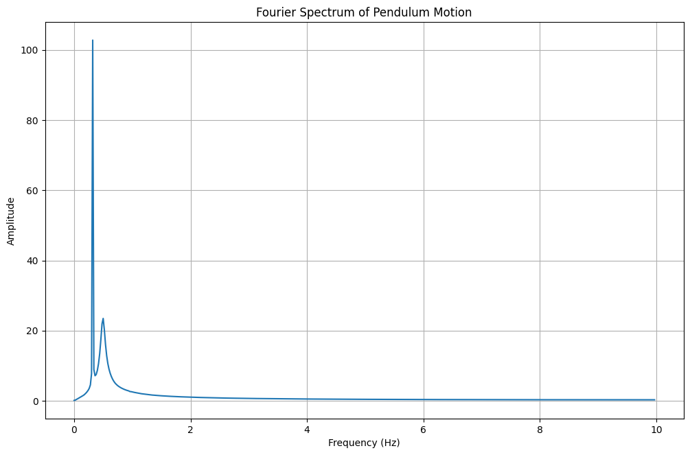

# Problem 2

# Investigating the Dynamics of a Forced Damped Pendulum

## Motivation

The forced damped pendulum is a fascinating example of a system where damping, restoring forces, and external periodic forcing interplay to create rich dynamic behavior. This system exhibits a variety of phenomena, including resonance, chaos, and quasiperiodicity, making it a valuable subject for studying complex real-world systems such as driven oscillators, climate models, and mechanical structures under periodic stress.

By adjusting parameters like damping, external force amplitude, and driving frequency, the system transitions through different behaviors, such as synchronized oscillations, chaotic motion, and resonance phenomena. Understanding these behaviors has significant implications for fields like energy harvesting, vibration isolation, and mechanical resonance.

## Theoretical Foundation

The motion of a forced damped pendulum is governed by the differential equation:

\[\frac{d^2\theta}{dt^2} + b \frac{d\theta}{dt} + \frac{g}{L} \sin(\theta) = A \cos(\omega t)\]

where:

- \( \theta(t) \) is the angular displacement,
- \( b \) is the damping coefficient,
- \( g \) is the gravitational acceleration,
- \( L \) is the length of the pendulum,
- \( A \) is the amplitude of the external force,
- \( \omega \) is the driving frequency.

### Small-Angle Approximation

For small angles, we approximate \( \sin\theta \approx \theta \), reducing the equation to:

\[\frac{d^2\theta}{dt^2} + b \frac{d\theta}{dt} + \frac{g}{L} \theta = A \cos(\omega t)\]

This equation describes a forced damped harmonic oscillator with the general solution:

\[\theta(t) = \theta_0 e^{-bt/2} \cos(\omega t - \delta)\]

where \( \theta_0 \) and \( \delta \) depend on the system parameters.

### Resonance Conditions

Resonance occurs when the driving frequency \( \omega \) matches the natural frequency:

\[ \omega_0 = \sqrt{\frac{g}{L}} \]

At resonance, the amplitude grows significantly unless limited by damping.

## Analysis of Dynamics

### Effects of Parameters

- **Damping coefficient (\( b \))**: Higher damping reduces oscillation amplitude and affects stability.
- **Driving amplitude (\( A \))**: Higher values increase oscillation response and can induce chaotic behavior.
- **Driving frequency (\( \omega \))**: Near resonance, large oscillations appear, leading to energy amplification.

### Transition to Chaos

Beyond simple oscillations, varying \( b \), \( A \), and \( \omega \) leads to quasiperiodic or chaotic motion. The transition to chaos can be observed using bifurcation diagrams and Poincaré sections. These chaotic behaviors arise from the system’s sensitivity to initial conditions, a hallmark of deterministic chaos.

## Practical Applications

- **Energy Harvesting**: Used in piezoelectric devices to convert oscillatory motion into electrical energy.
- **Suspension Bridges**: Models forced oscillations under periodic forces, such as wind or traffic-induced vibrations.
- **Oscillating Circuits**: Analogous to driven RLC circuits, where voltage replaces angular displacement and current replaces velocity.
- **Biological Rhythms**: Similar dynamics appear in human gait patterns and circadian rhythms under external influences.
- **Seismic Engineering**: Structures subjected to periodic seismic forcing can be analyzed using pendulum models.
- **Planetary Motion**: Certain planetary rotational dynamics exhibit nonlinear oscillatory behavior similar to forced pendulums.

## Graphical Representations

- **Time Series**: Plots of \( \theta(t) \) to observe periodicity or chaos.
  
- **Phase Portraits**: \( \theta \) vs. \( \frac{d\theta}{dt} \) to analyze system stability and attractors.
  
- **Poincaré Sections**: Used to detect chaotic behavior by sampling system states at discrete time intervals.
  
- **Bifurcation Diagrams**: Show transitions to complex motion as system parameters are varied, revealing period-doubling cascades leading to chaos.
  
- **Lyapunov Exponents**: Used to quantify chaos by measuring the rate of separation of nearby trajectories.
  
- **Fourier Spectra**: Analyzes frequency components of motion to distinguish between periodic, quasiperiodic, and chaotic behavior.
  

## Python Simulation

Simulation of the motion of a forced damped pendulum using the Runge-Kutta method and generates multiple plots. 

## Conclusion

This study of the forced damped pendulum provides insight into nonlinear dynamics, resonance, and chaos, with applications in physics and engineering. By using numerical simulations, we can explore a range of behaviors from simple periodic motion to chaotic dynamics, offering deeper understanding and practical implications in various scientific domains. The forced damped pendulum serves as a fundamental model for diverse physical systems, reinforcing the significance of nonlinear dynamics in both theoretical and applied research.
