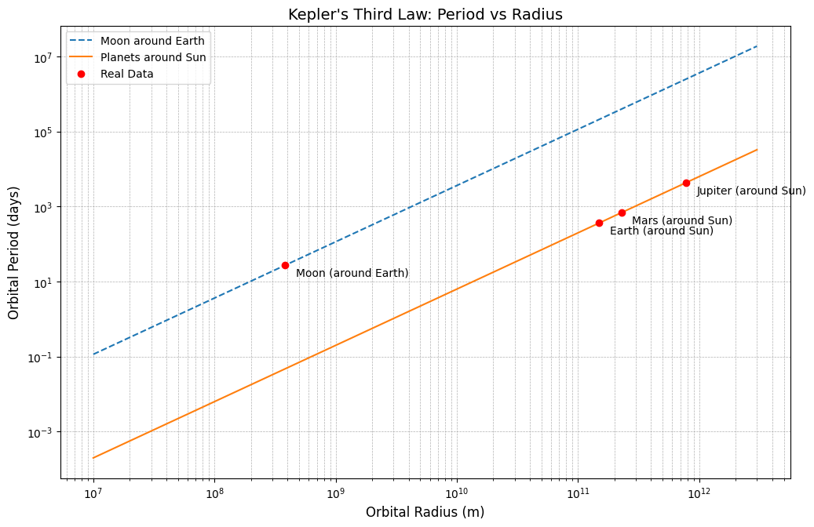

Here’s an edited version of the content where the derivations of Kepler’s Third Law come first, before the explanation and applications:

---

# Problem 1

# Orbital Period and Orbital Radius: Kepler's Third Law

## Derivation of Kepler's Third Law

Kepler’s Third Law establishes a relationship between the orbital period of a planet (or any object) and its distance from the central body it orbits. To understand how this law works, we derive it from fundamental principles of physics.

### 1. Gravitational Force

The **gravitational force** acting on a planet of mass \( m \), which is at a distance \( r \) from the central body, is given by:

\[
F_g = \frac{GMm}{r^2}
\]

Where:

- \( F_g \) is the gravitational force (in newtons),
- \( G \) is the gravitational constant (\(6.67430 \times 10^{-11} \, m^3 kg^{-1} s^{-2}\)),
- \( M \) is the mass of the central body (in kg),
- \( r \) is the distance from the center of the central body (in meters),
- \( m \) is the mass of the orbiting object.

### 2. Centripetal Force

The object needs a **centripetal force** to keep it in orbit. The centripetal force is provided by gravity, and it can be expressed as:

\[
F_c = \frac{m v^2}{r}
\]

Where:

- \( F_c \) is the centripetal force (in newtons),
- \( v \) is the orbital velocity of the object.

### 3. Equating the Forces

For a circular orbit, the gravitational force provides the necessary centripetal force to keep the object in orbit. Therefore, we set \( F_g = F_c \):

\[
\frac{GMm}{r^2} = \frac{m v^2}{r}
\]

### 4. Expressing Velocity in Terms of Orbital Period

The velocity of an orbiting object is related to the orbital period \( T \) by the following equation:

\[
v = \frac{2\pi r}{T}
\]

Substituting this expression for velocity into the force equation:

\[
\frac{GMm}{r^2} = \frac{m (2\pi r / T)^2}{r}
\]

### 5. Simplifying the Equation

Now, we can simplify this equation:

\[
GM = \frac{4\pi^2 r^3}{T^2}
\]

### 6. Solving for the Orbital Period

Rearranging the equation to solve for the orbital period \( T \), we get:

\[
T^2 = \frac{4\pi^2 r^3}{GM}
\]

This is the **modern Newtonian form** of Kepler's Third Law, which states that the square of the orbital period is proportional to the cube of the orbital radius.

## Kepler’s Third Law

Kepler’s Third Law provides a relationship between the orbital period \( T \) and the orbital radius \( r \):

\[
T^2 = \frac{4\pi^2 r^3}{GM}
\]

Where:

- \( T \) is the orbital period (in seconds),
- \( r \) is the orbital radius (in meters),
- \( G \) is the gravitational constant (\(6.67430 \times 10^{-11} \, m^3 kg^{-1} s^{-2}\)),
- \( M \) is the mass of the central body (in kg).

This equation reveals that **larger orbital radii correspond to longer orbital periods**, which is an important factor in understanding the motion of planets, moons, and artificial satellites.

## Introduction to Kepler's Laws

Kepler’s laws were first formulated in the early 17th century by **Johannes Kepler** based on the careful observations of planetary motion by **Tycho Brahe**. These laws describe how planets move around the Sun and how their orbital characteristics are related.

### Kepler's Three Laws:

| Kepler's Law                        | Description                                                                                                                          |
| ----------------------------------- | ------------------------------------------------------------------------------------------------------------------------------------ |
| **First Law (Law of Ellipses)**     | Planets move in **elliptical orbits** with the Sun at one focus.                                                                     |
| **Second Law (Law of Equal Areas)** | A planet sweeps out **equal areas in equal time intervals**, meaning it moves faster when closer to the Sun and slower when farther. |
| **Third Law (Law of Harmonies)**    | The **square of a planet's orbital period** is proportional to the **cube of its orbital radius**.                                   |

Kepler's Third Law was empirically observed but later derived from **Newton's Law of Universal Gravitation**, which showed that these relationships are a natural consequence of gravitational forces.

## Applications in Astronomy

Kepler’s Third Law is useful in various fields, including astronomy, space exploration, and satellite motion:

### 1. **Determining Planetary Masses**

By measuring the orbital period and distance of a planet’s moon, we can calculate the mass of the planet using:

\[
M = \frac{4\pi^2 r^3}{G T^2}
\]

For example, the mass of **Earth** can be determined by analyzing the Moon’s orbit.

### 2. **Satellite Motion**

Engineers use Kepler’s Third Law to design satellites and space stations. By selecting the appropriate altitude, they can ensure stable orbits for satellites such as GPS and communication satellites.

| Satellite              | Orbital Radius (km) | Orbital Period (hours) |
| ---------------------- | ------------------- | ---------------------- |
| GPS                    | 26,600              | 12                     |
| Geostationary          | 42,164              | 24                     |
| Hubble Space Telescope | 6,978               | 1.5                    |

### 3. **Exoplanet Discovery**

Astronomers detect exoplanets by measuring the dimming of stars due to planetary transits. Using Kepler’s Third Law, they estimate the planet’s distance from its star and deduce whether it lies in the **habitable zone**.

| Exoplanet          | Orbital Radius (AU) | Orbital Period (Days) |
| ------------------ | ------------------- | --------------------- |
| Kepler-22b         | 0.85                | 290                   |
| Proxima Centauri b | 0.05                | 11.2                  |
| 51 Pegasi b        | 0.05                | 4.2                   |

### 4. **Comparing Different Orbital Systems**

Kepler’s Law helps compare planetary orbits in different star systems and allows astronomers to analyze binary star systems.

## The Solar System and Kepler’s Law

The following table lists the **orbital radius and period** of major planets in the Solar System, illustrating Kepler’s Third Law.

| Planet  | Orbital Radius (AU) | Orbital Period (Years) | $T^2$    | $r^3$    |
| ------- | ------------------- | ---------------------- | -------- | -------- |
| Mercury | 0.39                | 0.24                   | 0.0576   | 0.0593   |
| Venus   | 0.72                | 0.62                   | 0.3844   | 0.3732   |
| Earth   | 1.00                | 1.00                   | 1.0000   | 1.0000   |
| Mars    | 1.52                | 1.88                   | 3.5344   | 3.5123   |
| Jupiter | 5.20                | 11.86                  | 140.6596 | 140.6080 |
| Saturn  | 9.58                | 29.46                  | 867.0916 | 881.1824 |

The values for \( T^2 \) and \( r^3 \) confirm the **proportional relationship predicted by Kepler's Third Law**.

## Conclusion

Kepler’s Third Law provides a crucial link between **gravity and orbital motion**. It extends beyond planets and applies to **moons, artificial satellites, and even binary star systems**. By analyzing Kepler’s Third Law, astronomers can determine planetary masses, satellite trajectories, and the structure of distant star systems.

## Implementation in Python

The following Python script computes orbital periods for different celestial bodies and visualizes the relationship.



```python
import numpy as np
import matplotlib.pyplot as plt

def keplers_third_law(G, M, radii):
    """
    Computes the orbital periods based on Kepler's Third Law: T^2 = (4π^2 * r^3) / (G * M)

    Parameters:
    G : float : Gravitational constant (m^3 kg^-1 s^-2)
    M : float : Mass of the central body (kg)
    radii : array : Orbital radii (m)

    Returns:
    periods : array : Orbital periods (s)
    """
    return np.sqrt((4 * np.pi**2 * radii**3) / (G * M))

# Constants
G = 6.67430e-11  # Gravitational constant (m^3 kg^-1 s^-2)
M_earth = 5.972e24  # Mass of Earth (kg)
M_sun = 1.989e30  # Mass of Sun (kg)

# Orbital radii (in meters)
radii = np.array([
    3.844e8,  # Moon around Earth
    1.496e11, # Earth around Sun
    2.279e11, # Mars around Sun
    7.785e11  # Jupiter around Sun
])

# Compute periods
periods_earth = keplers_third_law(G, M_earth, radii[:1])  # Moon orbiting Earth
periods_sun = keplers_third_law(G, M_sun, radii[1:])  # Planets orbiting the Sun

# Convert seconds to days
periods_earth_days = periods_earth / (60 * 60 * 24)
periods_sun_days = periods_sun / (60 * 60 * 24)

# Print computed values in table format
print(f"{'Celestial Body':<20}{'Orbital Radius (m)':<25}{'Orbital Period (days)':<25}")
print("-" * 70)
celestial_bodies = ["Moon (around Earth)", "Earth (around Sun)", "Mars (around Sun)", "Jupiter (around Sun)"]
all_periods = np.concatenate([periods_earth_days, periods_sun_days])

for i in range(len(radii)):
    print(f"{celestial_bodies[i]:<20}{radii[i]:<25.3e}{all_periods[i]:<25.3f}")

# Plot results
radii_plot = np.linspace(1e7, 3e12, 100)  # Extended range of radii
periods_plot_earth = keplers_third_law(G, M_earth, radii_plot)
periods_plot_sun = keplers_third_law(G, M_sun, radii_plot)

plt.figure(figsize=(12, 7.5))
plt.loglog(radii_plot, periods_plot_earth / (60 * 60 * 24), label='Moon around Earth', linestyle='dashed')
plt.loglog(radii_plot, periods_plot_sun / (60 * 60 * 24), label='Planets around Sun', linestyle='solid')
plt.scatter(radii, all_periods, color='red', zorder=3, label='Real Data')

# Add annotations for clarity
for i, txt in enumerate(celestial_bodies):
    plt.annotate(txt, (radii[i], all_periods[i]), textcoords="offset points", xytext=(10,-10), ha='left')

# Improve axis labels
plt.xlabel('Orbital Radius (m)', fontsize=12)
plt.ylabel('Orbital Period (days)', fontsize=12)
plt.title("Kepler's Third Law: Period vs Radius", fontsize=14)
plt.legend()
plt.grid(True, which='both', linestyle='--', linewidth=0.5)
plt.show()
```
