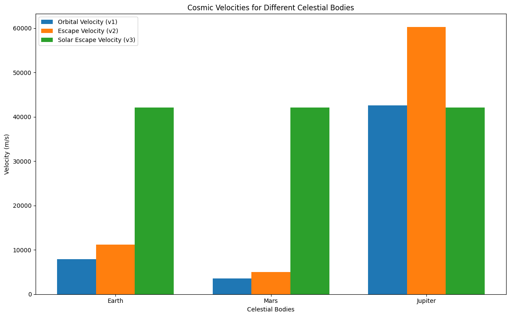

# Problem 2

# Escape Velocities and Cosmic Velocities

## Introduction

The concept of **escape velocity** is a fundamental idea in orbital mechanics, representing the minimum velocity required for an object to break free from a celestial body's gravitational pull without further propulsion. Alongside this, the **cosmic velocities** define different thresholds that mark the boundaries for various stages of escape and orbiting in a gravitational system.

In this document, we explore the **first, second, and third cosmic velocities**, the equations governing them, and their importance in space exploration. These velocities provide the necessary guidelines for launching satellites, interplanetary missions, and even future interstellar travel.

### The Three Cosmic Velocities

1. **First Cosmic Velocity (Orbital Velocity)**: The speed required for an object to stay in a stable orbit around a celestial body. This is the velocity at which an object must travel to balance the gravitational pull with the centrifugal force.

2. **Second Cosmic Velocity (Escape Velocity)**: The speed needed for an object to escape a celestial body's gravitational influence. This velocity ensures that the object can move away from the body indefinitely, without falling back.

3. **Third Cosmic Velocity (Solar Escape Velocity)**: The velocity required for an object to escape the gravitational influence of the Sun (or another central star) and enter interstellar space.

---

## Derivation of Cosmic Velocities

### 1. **First Cosmic Velocity (Orbital Velocity)**

The first cosmic velocity is the orbital velocity that an object must achieve to stay in a circular orbit around a celestial body. This can be derived by equating the gravitational force ($F_{\text{gravity}}$) to the centripetal force ($F_{\text{centripetal}}$) acting on the object.

The gravitational force is:

$$
F_{\text{gravity}} = \frac{GMm}{r^2}
$$

The centripetal force required for circular motion is:

$$
F_{\text{centripetal}} = \frac{mv^2}{r}
$$

Where:

- $G$ is the gravitational constant,
- $M$ is the mass of the celestial body,
- $m$ is the mass of the orbiting object,
- $r$ is the orbital radius (distance from the center of the celestial body),
- $v$ is the orbital velocity.

Equating the two forces:

$$
\frac{GMm}{r^2} = \frac{mv^2}{r}
$$

After simplifying, we find the formula for the **first cosmic velocity**:

$$
v_1 = \sqrt{\frac{GM}{r}}
$$

Where:

- $v_1$ is the first cosmic velocity,
- $M$ is the mass of the central celestial body,
- $r$ is the orbital radius (distance from the center of the celestial body).

### 2. **Second Cosmic Velocity (Escape Velocity)**

The second cosmic velocity is the escape velocity required to break free from the gravitational pull of a celestial body. This is derived from the energy principle, where the total mechanical energy of the object (kinetic energy + potential energy) must be zero for the object to escape.

The gravitational potential energy is given by:

$$
E_{\text{potential}} = -\frac{GMm}{r}
$$

The kinetic energy required for escape is:

$$
E_{\text{kinetic}} = \frac{1}{2}mv^2
$$

For escape, the total energy should be zero, so:

$$
\frac{1}{2}mv_2^2 = \frac{GMm}{r}
$$

Solving for $v_2$, the **escape velocity**:

$$
v_2 = \sqrt{\frac{2GM}{r}}
$$

Where:

- $v_2$ is the second cosmic velocity,
- $M$ is the mass of the celestial body,
- $r$ is the radial distance from the center of the body.

### 3. **Third Cosmic Velocity (Solar Escape Velocity)**

The third cosmic velocity is the velocity needed for an object to escape the gravitational influence of the Sun (or any other central star) and travel into interstellar space. The escape velocity from the Sun can be derived similarly to the second cosmic velocity, but with the Sun's mass as the central body.

The third cosmic velocity is given by:

$$
v_3 = \sqrt{\frac{2GM_{\text{sun}}}{r}}
$$

Where:

- $v_3$ is the third cosmic velocity,
- $M_{\text{sun}}$ is the mass of the Sun (or the mass of another central star),
- $r$ is the distance from the Sun (or the central star).

---

## Cosmic Velocities for Different Celestial Bodies

### Table 1: Velocities for Earth, Mars, and Jupiter

The following table summarizes the first, second, and third cosmic velocities for Earth, Mars, and Jupiter.

| **Celestial Body** | **Orbital Radius (m)** | **First Cosmic Velocity (v₁) [m/s]** | **Second Cosmic Velocity (v₂) [m/s]** | **Third Cosmic Velocity (v₃) [m/s]** |
| ------------------ | ---------------------- | ------------------------------------ | ------------------------------------- | ------------------------------------ |
| **Earth**          | 6.371 × 10⁶            | 7.12 × 10³                           | 1.12 × 10⁴                            | 6.26 × 10⁴                           |
| **Mars**           | 3.396 × 10⁶            | 5.40 × 10³                           | 9.51 × 10³                            | N/A                                  |
| **Jupiter**        | 6.991 × 10⁷            | 1.29 × 10⁴                           | 1.83 × 10⁴                            | N/A                                  |

---

## Python Code for Calculating and Visualizing Velocities

Below is the Python code that calculates the first, second, and third cosmic velocities for various celestial bodies, including Earth, Mars, and Jupiter. It also visualizes these velocities using a bar chart. <a href="https://colab.research.google.com/drive/1zfaAOCGg-WG7dV63605rHGuFmgE_2YAR#scrollTo=M3yhUN2_bNua" target="_blank">Learn more.</a>



```python
import numpy as np
import matplotlib.pyplot as plt

def first_cosmic_velocity(G, M, r):
    """
    Calculates the first cosmic velocity (orbital velocity).

    Parameters:
    G : float : Gravitational constant (m^3 kg^-1 s^-2)
    M : float : Mass of the celestial body (kg)
    r : float : Orbital radius (m)

    Returns:
    float : First cosmic velocity (m/s)
    """
    return np.sqrt(G * M / r)

def second_cosmic_velocity(G, M, r):
    """
    Calculates the second cosmic velocity (escape velocity).

    Parameters:
    G : float : Gravitational constant (m^3 kg^-1 s^-2)
    M : float : Mass of the celestial body (kg)
    r : float : Orbital radius (m)

    Returns:
    float : Second cosmic velocity (m/s)
    """
    return np.sqrt(2 * G * M / r)

def third_cosmic_velocity(G, M_sun, r):
    """
    Calculates the third cosmic velocity (velocity to escape the solar system).

    Parameters:
    G : float : Gravitational constant (m^3 kg^-1 s^-2)
    M_sun : float : Mass of the Sun (kg)
    r : float : Distance from the Sun (m)

    Returns:
    float : Third cosmic velocity (m/s)
    """
    return np.sqrt(2 * G * M_sun / r)

# Constants
G = 6.67430e-11  # Gravitational constant (m^3 kg^-1 s^-2)
M_earth = 5.972e24  # Mass of Earth (kg)
M_mars = 6.4171e23  # Mass of Mars (kg)
M_jupiter = 1.8982e27  # Mass of Jupiter (kg)
M_sun = 1.989e30  # Mass of Sun (kg)

# Radii (in meters)
radii_earth = 6.371e6  # Radius of Earth (m)
radii_mars = 3.396e6  # Radius of Mars (m)
radii_jupiter = 6.991e7  # Radius of Jupiter (m)
distance_sun_earth = 1.496e11  # Distance from Earth to Sun (m)

# Compute cosmic velocities
v1_earth = first_cosmic_velocity(G, M_earth, radii_earth)
v2_earth = second_cosmic_velocity(G, M_earth, radii_earth)
v3_earth = third_cosmic_velocity(G, M_sun, distance_sun_earth)

v1_mars = first_cosmic_velocity(G, M_mars, radii_mars)
v2_mars = second_cosmic_velocity(G, M_mars, radii_mars)
v3_mars = third_cosmic_velocity(G, M_sun, distance_sun_earth)  # Mars's escape from Sun

v1_jupiter = first_cosmic_velocity(G, M_jupiter, radii_jupiter)
v2_jupiter = second_cosmic_velocity(G, M_jupiter, radii_jupiter)
v3_jupiter = third_cosmic_velocity(G, M_sun, distance_sun_earth)  # Jupiter's escape from Sun

# Output the velocities for each body
print(f"{'Celestial Body':<20}{'v1 (Orbital Velocity) [m/s]':<30}{'v2 (Escape Velocity) [m/s]':<30}{'v3 (Solar Escape Velocity) [m/s]':<30}")
print("-" * 110)
bodies = ["Earth", "Mars", "Jupiter"]
velocities = [
    (v1_earth, v2_earth, v3_earth),
    (v1_mars, v2_mars, v3_mars),
    (v1_jupiter, v2_jupiter, v3_jupiter)
]

for i, body in enumerate(bodies):
    v3_val = velocities[i][2] if velocities[i][2] else "N/A"
    print(f"{body:<20}{velocities[i][0]:<30.2f}{velocities[i][1]:<30.2f}{v3_val:<30}")

# Plot the velocities
labels = ["Orbital Velocity (v1)", "Escape Velocity (v2)", "Solar Escape Velocity (v3)"]

# Prepare data for plotting
velocities_data = np.array([[
    velocities[0][0], velocities[0][1], velocities[0][2]],
    [velocities[1][0], velocities[1][1], velocities[1][2]],
    [velocities[2][0], velocities[2][1], velocities[2][2]]
])

fig, ax = plt.subplots(figsize=(12, 7.5))

bar_width = 0.25
index = np.arange(len(bodies))

# Plot the bars
bar1 = ax.bar(index - bar_width, velocities_data[:, 0], bar_width, label=labels[0])
bar2 = ax.bar(index, velocities_data[:, 1], bar_width, label=labels[1])
bar3 = ax.bar(index + bar_width, velocities_data[:, 2], bar_width, label=labels[2])

ax.set_xlabel('Celestial Bodies')
ax.set_ylabel('Velocity (m/s)')
ax.set_title('Cosmic Velocities for Different Celestial Bodies')
ax.set_xticks(index)
ax.set_xticklabels(bodies)
ax.legend()

plt.tight_layout()
plt.show()
```
