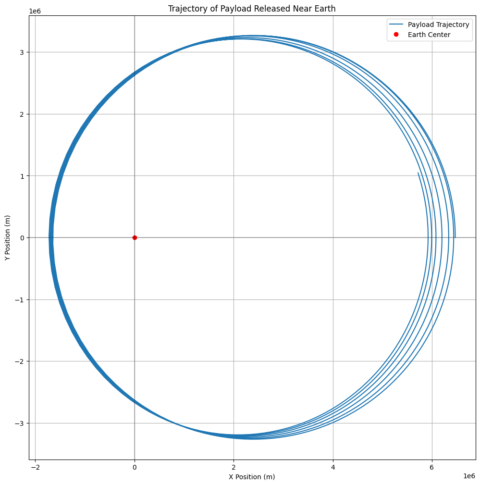

# Problem 3

# Trajectories of a Freely Released Payload Near Earth

## Introduction

When a payload is released from a moving rocket near Earth, its trajectory depends on various factors such as its initial velocity, position, and the gravitational forces it experiences. Depending on these initial conditions, the payload can follow different types of trajectories such as elliptical, parabolic, or hyperbolic. These trajectories are critical for space missions, including satellite deployment, payload recovery, and even interplanetary travel.

Understanding the different trajectories that a payload can follow, based on its velocity and position relative to Earth, is essential for mission planning. This document discusses the underlying physics of gravitational forces, derives the equations of motion, explains the types of possible trajectories, and provides a simulation of a payload's trajectory near Earth.

## Gravitational Force and Equations of Motion

The motion of a payload near Earth is governed by Newton’s law of gravitation. The gravitational force acting on an object of mass $m$ at a distance $r$ from the center of Earth is given by:

$$
F = \frac{G M m}{r^2}
$$

Where:

- $F$ is the gravitational force (in newtons),
- $G$ is the gravitational constant, $6.67430 \times 10^{-11} \, \text{m}^3 \, \text{kg}^{-1} \, \text{s}^{-2}$,
- $M$ is the mass of Earth ($5.972 \times 10^{24} \, \text{kg}$),
- $m$ is the mass of the payload,
- $r$ is the distance from the center of Earth to the payload (in meters).

The force is responsible for the acceleration of the payload towards Earth. The acceleration $a$ is given by:

$$
a = \frac{F}{m} = \frac{GM}{r^2}
$$

This is also referred to as **gravitational acceleration**. The second-order differential equation describing the motion of an object under Earth's gravity is:

$$
\frac{d^2 r}{dt^2} = -\frac{GM}{r^2}
$$

This equation forms the foundation for calculating the trajectory of the payload.

## Types of Trajectories

The trajectory of a payload released near Earth depends on its initial velocity. Based on the velocity, the trajectory could be one of the following:

### 1. **Elliptical Trajectory**

When the initial velocity is less than the escape velocity, the payload follows an elliptical trajectory. The payload will eventually return to Earth after completing its elliptical orbit. This type of trajectory is typical for satellites in low Earth orbit (LEO).

The equation for an elliptical orbit is derived from **Kepler’s Laws of Planetary Motion** and is given by:

$$
r(t) = \frac{a(1 - e^2)}{1 + e \cos(\theta)}
$$

Where:

- $a$ is the semi-major axis,
- $e$ is the orbital eccentricity,
- $\theta$ is the true anomaly (the angle between the payload and the periapsis).

### 2. **Parabolic Trajectory**

When the payload's initial velocity is equal to the **escape velocity** at a given distance from Earth, its trajectory will be parabolic. A parabolic trajectory is the boundary between bound and unbound motion, and it represents the exact condition for escaping Earth's gravity.

The escape velocity at any point is given by:

$$
v_{\text{esc}} = \sqrt{\frac{2GM}{r}}
$$

Where:

- $v_{\text{esc}}$ is the escape velocity,
- $r$ is the distance from Earth's center.

### 3. **Hyperbolic Trajectory**

If the payload's initial velocity exceeds the escape velocity, the trajectory will be hyperbolic. In this case, the payload escapes Earth's gravitational influence completely, traveling on a path that takes it far beyond Earth. The trajectory is open, meaning the payload will not return to Earth.

For a hyperbolic trajectory, the total energy of the object is positive, and the velocity at infinity exceeds the escape velocity.

## Escape Velocity

The **escape velocity** is the minimum velocity an object must have in order to escape the gravitational pull of Earth, without needing further propulsion. The escape velocity at a distance $r$ from Earth's center is given by:

$$
v_{\text{esc}} = \sqrt{\frac{2GM}{r}}
$$

Where:

- $v_{\text{esc}}$ is the escape velocity (m/s),
- $G$ is the gravitational constant,
- $M$ is the mass of Earth,
- $r$ is the distance from Earth's center.

At the Earth's surface ($r = R_{\text{Earth}}$), the escape velocity is approximately 11.2 km/s.

## Numerical Simulation of Trajectories

To simulate the trajectory of a payload under the influence of Earth’s gravity, we use numerical methods, particularly the **Runge-Kutta method** to solve the equations of motion. Below is a Python script that simulates the trajectory of a payload based on its initial position and velocity. <a href="https://colab.research.google.com/drive/1Ednr7-CPkA0YtiMMcqQB_HHBQg6yCsmH#scrollTo=EL_sji7HhYQI" target="_blank">Learn more.</a>



```python
import numpy as np
import matplotlib.pyplot as plt
from scipy.integrate import solve_ivp

# Constants
G = 6.67430e-11  # Gravitational constant (m^3 kg^-1 s^-2)
M_earth = 5.972e24  # Mass of Earth (kg)
R_earth = 6.371e6  # Radius of Earth (m)

def gravitational_force(t, y):
    """
    Computes the gravitational acceleration and velocity of the payload.

    Parameters:
    t : float : Time (s)
    y : array : State vector [x, y, vx, vy], where x, y are positions and vx, vy are velocities.

    Returns:
    dydt : array : Derivatives [vx, vy, ax, ay]
    """
    x, y, vx, vy = y
    r = np.sqrt(x**2 + y**2)  # Distance from the center of the Earth

    # Gravitational acceleration
    ax = -G * M_earth * x / r**3
    ay = -G * M_earth * y / r**3

    return [vx, vy, ax, ay]

def simulate_trajectory(initial_conditions, t_span, t_eval):
    """
    Simulates the trajectory of a payload released from Earth under the influence of gravity.

    Parameters:
    initial_conditions : array : Initial state [x0, y0, vx0, vy0]
    t_span : tuple : Time span (t0, tf)
    t_eval : array : Time steps at which to evaluate the solution

    Returns:
    sol : object : Solution object from scipy.integrate.solve_ivp
    """
    sol = solve_ivp(gravitational_force, t_span, initial_conditions, t_eval=t_eval, method='RK45')
    return sol

# Initial conditions for the payload (position in meters, velocity in m/s)
initial_conditions = [R_earth + 100000, 0, 0, 5000]  # Released 100 km above Earth, velocity in x-direction
t_span = (0, 15000)  # Simulate for 15000 seconds
t_eval = np.linspace(t_span[0], t_span[1], 1000)

# Simulate the trajectory
sol = simulate_trajectory(initial_conditions, t_span, t_eval)

# Extract the results
x, y = sol.y[0], sol.y[1]

# Plot the trajectory
plt.figure(figsize=(12, 12))
plt.plot(x, y, label="Payload Trajectory")
plt.plot(0, 0, 'ro', label="Earth Center")
plt.axhline(0, color='black',linewidth=0.3)
plt.axvline(0, color='black',linewidth=0.3)
plt.xlabel('X Position (m)')
plt.ylabel('Y Position (m)')
plt.title('Trajectory of Payload Released Near Earth')
plt.legend()
plt.grid(True)
plt.show()

```
