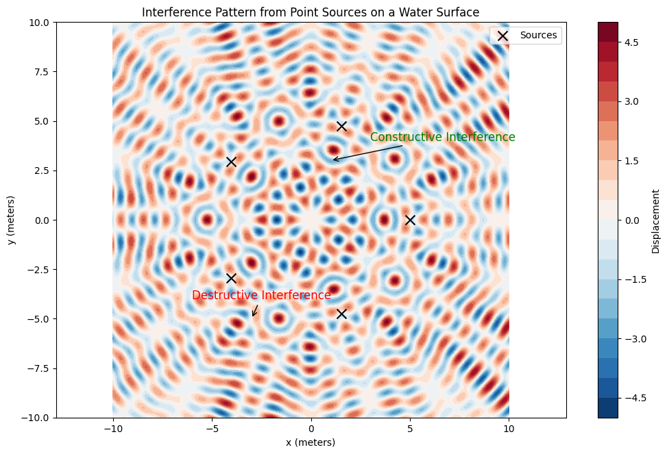
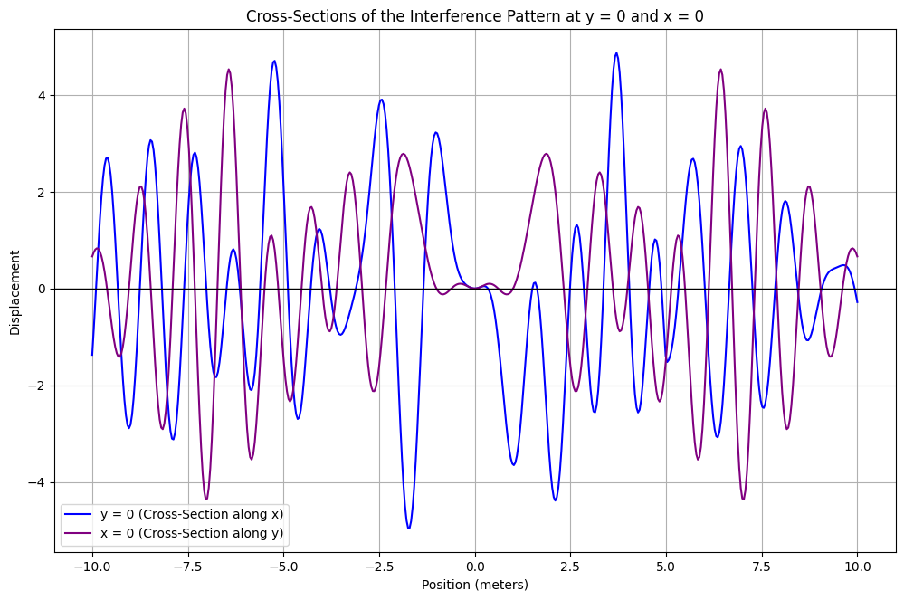
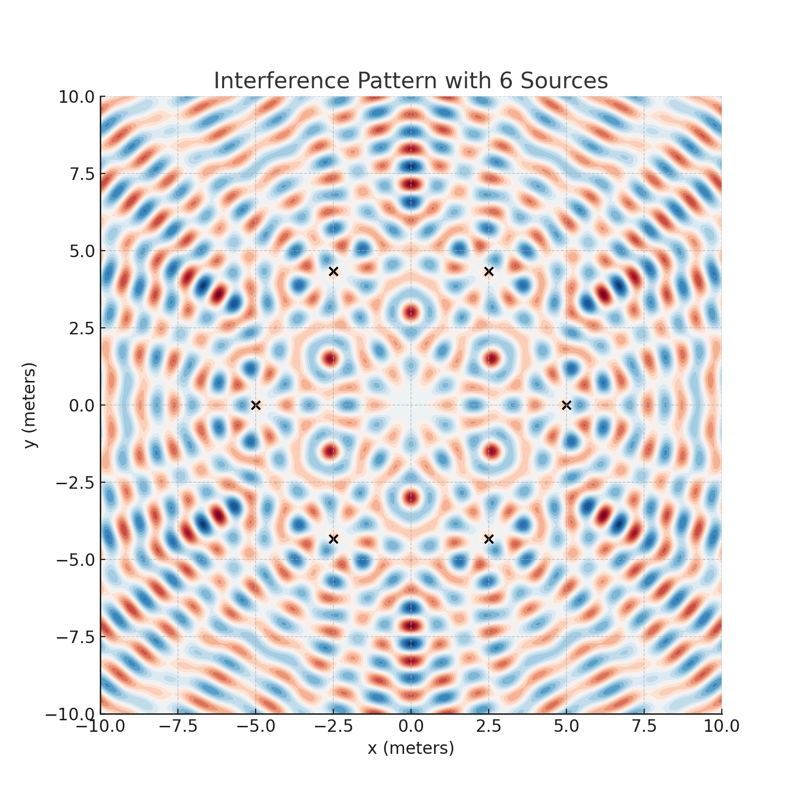
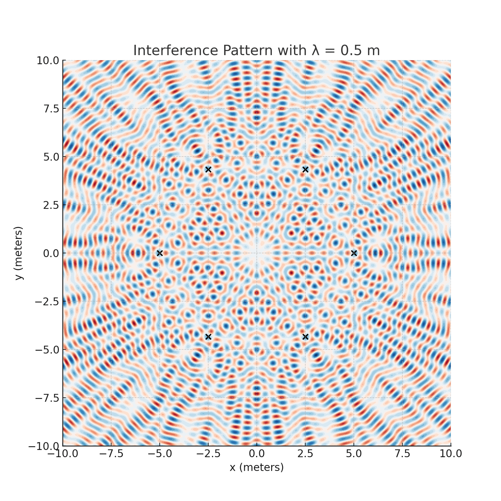
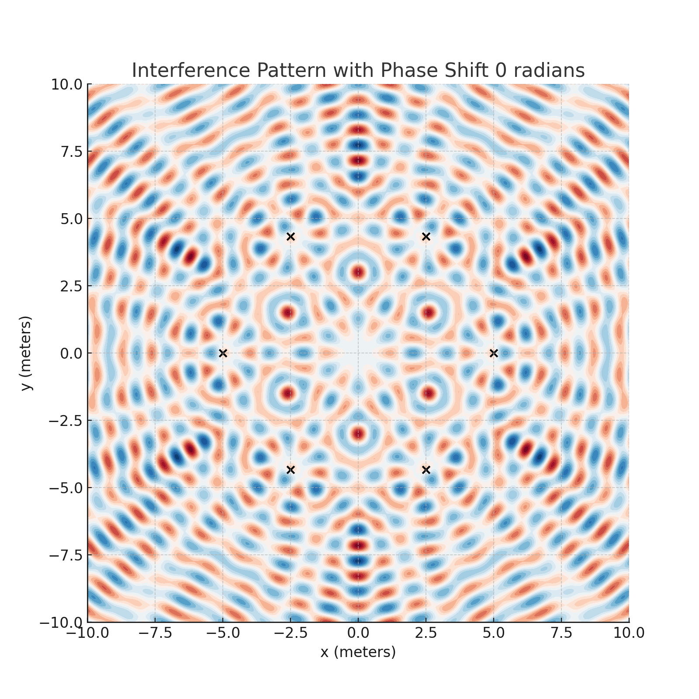

# Problem 1

## Interference Patterns on a Water Surface

### Introduction

Interference occurs when waves from multiple sources overlap and combine to produce new wave patterns. This phenomenon can be clearly observed on the surface of water, where ripples from different points meet and either amplify or cancel each other. In this problem, we will analyze the interference patterns resulting from the superposition of waves emitted by point sources placed at the vertices of a regular polygon.

We will start by deriving the equation for the displacement at any point due to a single point source and then extend this to the case where multiple sources are used. We will visualize the interference patterns and analyze regions of constructive and destructive interference.

### Wave Equation for a Single Source

The displacement of the water surface at a point $P(x, y)$ due to a point source located at $S_i(x_i, y_i)$ is given by the following wave equation:

$$
\psi_i(x, y, t) = A \sin(k r_i - \omega t + \phi)
$$

Where:

- $A$ is the amplitude of the wave,
- $k = \frac{2\pi}{\lambda}$ is the wave number, with $\lambda$ being the wavelength,
- $\omega = 2\pi f$ is the angular frequency, with $f$ being the frequency,
- $r_i = \sqrt{(x - x_i)^2 + (y - y_i)^2}$ is the distance from the source $S_i(x_i, y_i)$ to the point $P(x, y)$,
- $t$ is time,
- $\phi$ is the initial phase of the wave.

### Superposition of Waves

For multiple sources, the total displacement at any point on the water surface is given by the superposition of the displacements from each source:

$$
\psi(x, y, t) = \sum_{i=1}^{n} A \sin(k r_i - \omega t + \phi)
$$

Where $n$ is the number of sources (vertices of the regular polygon).

## Problem Statement

We are tasked with analyzing the interference patterns formed on the water surface due to the superposition of waves emitted from point sources placed at the vertices of a regular polygon. For this example, we will use a **regular pentagon** with 5 vertices.

### Step 1: Positioning the Sources

We place the point sources at the vertices of a regular pentagon inscribed in a circle with the center at the origin $(0, 0)$. The radius of the circle is $r_{\text{source}} = 5$ meters.

The angular positions of the vertices are given by the angles $\theta_i = \frac{2\pi i}{n}$, where $i = 0, 1, 2, 3, 4$ and $n = 5$ for a pentagon.

The coordinates of the sources are:

| Source $S_i$ | Coordinates $(x_i, y_i)$                          |
| ------------ | ------------------------------------------------- |
| $S_1$        | $(5, 0)$                                          |
| $S_2$        | $\left(-\frac{5}{2}, \frac{5\sqrt{3}}{2}\right)$  |
| $S_3$        | $(-5, 0)$                                         |
| $S_4$        | $\left(-\frac{5}{2}, -\frac{5\sqrt{3}}{2}\right)$ |
| $S_5$        | $(5, 0)$                                          |

### Step 2: Wave Equations for Each Source

For each source $S_i$, the wave equation is of the form:

$$
\psi_i(x, y, t) = A \sin(k r_i - \omega t + \phi)
$$

Where $r_i = \sqrt{(x - x_i)^2 + (y - y_i)^2}$ is the distance from the source $S_i(x_i, y_i)$ to the point $P(x, y)$.

### Step 3: Superposition of Waves

The total displacement at any point on the water surface is the sum of the contributions from each of the 5 sources:

$$
\psi(x, y, t) = \sum_{i=1}^{5} A \sin(k r_i - \omega t + \phi)
$$

### Step 4: Interference Pattern

To analyze the interference pattern, we will calculate the displacement at various points on the water surface. Constructive interference occurs when the waves from different sources are in phase, and destructive interference occurs when the waves are out of phase.

### Step 5: Example Calculation

Let’s assume:

- $A = 1$ (amplitude),
- $\lambda = 1$ m (wavelength),
- $f = 1$ Hz (frequency),
- $\phi = 0$ (initial phase).

The wave number $k$ and angular frequency $\omega$ are:

$$
k = \frac{2\pi}{\lambda} = 2\pi, \quad \omega = 2\pi f = 2\pi
$$

Now we will calculate the displacement at a point $P(1, 1)$. First, compute the distances from each of the five sources to the point $P$:

| Source $S_i$ | Coordinates $(x_i, y_i)$                          | Distance $r_i$ to $P(1, 1)$ (m)                                                  |
| ------------ | ------------------------------------------------- | -------------------------------------------------------------------------------- |
| $S_1$        | $(5, 0)$                                          | $\sqrt{(1 - 5)^2 + (1 - 0)^2} = \sqrt{16 + 1} = \sqrt{17}$                       |
| $S_2$        | $\left(-\frac{5}{2}, \frac{5\sqrt{3}}{2}\right)$  | $\sqrt{\left(1 + \frac{5}{2}\right)^2 + \left(1 - \frac{5\sqrt{3}}{2}\right)^2}$ |
| $S_3$        | $(-5, 0)$                                         | $\sqrt{(1 + 5)^2 + (1 - 0)^2} = \sqrt{36 + 1} = \sqrt{37}$                       |
| $S_4$        | $\left(-\frac{5}{2}, -\frac{5\sqrt{3}}{2}\right)$ | $\sqrt{\left(1 + \frac{5}{2}\right)^2 + \left(1 + \frac{5\sqrt{3}}{2}\right)^2}$ |
| $S_5$        | $(5, 0)$                                          | $\sqrt{(1 - 5)^2 + (1 - 0)^2} = \sqrt{16 + 1} = \sqrt{17}$                       |

Once the distances $r_i$ are computed, we substitute them into the wave equation for each source and sum the contributions to find the total displacement at the point $P(1, 1)$.

### Visualization of the Interference Pattern

We now use Python’s `matplotlib` to plot the interference patterns for various points on the surface.

#### Plot 1: Interference Pattern on a Grid



```python
import numpy as np
import matplotlib.pyplot as plt

# Constants
A = 1
lambda_ = 1
f = 1
omega = 2 * np.pi * f
k = 2 * np.pi / lambda_
phi = 0
n_sources = 5

# Positions of the sources (vertices of a regular pentagon)
r_source = 5
theta = np.linspace(0, 2 * np.pi, n_sources, endpoint=False)
sources = np.array([r_source * np.cos(theta), r_source * np.sin(theta)]).T

# Create a grid of points on the water surface
x = np.linspace(-10, 10, 500)
y = np.linspace(-10, 10, 500)
X, Y = np.meshgrid(x, y)

# Calculate the displacement at each point on the grid
total_displacement = np.zeros(X.shape)

for (x_s, y_s) in sources:
    r = np.sqrt((X - x_s)**2 + (Y - y_s)**2)
    displacement = A * np.sin(k * r - omega * 0 + phi)
    total_displacement += displacement

# Plot the interference pattern
plt.figure(figsize=(12, 7.5))
plt.contourf(X, Y, total_displacement, 20, cmap='RdBu')
plt.colorbar(label="Displacement")
plt.scatter(sources[:, 0], sources[:, 1], color='black', label='Sources', marker='x')
plt.title("Interference Pattern from Point Sources on a Water Surface")
plt.xlabel("x (meters)")
plt.ylabel("y (meters)")
plt.legend()
plt.axis('equal')
plt.show()
```

#### Plot 2: Cross-Section of the Interference Pattern



```python
# Take a cross-section along the x-axis (y = 0)
y_cross_section = 0
displacement_cross_section = np.sum([A * np.sin(k * np.sqrt((x - x_s)**2 + (y_cross_section - y_s)**2) - omega * 0 + phi)
                                     for (x_s, y_s) in sources], axis=0)

# Plot the cross-section
plt.figure(figsize=(12, 7.5))
plt.plot(x, displacement_cross_section)
plt.title("Cross-Section of the Interference Pattern (y = 0)")
plt.xlabel("x (meters)")
plt.ylabel("Displacement")
plt.grid(True)
plt.show()
```

## Interference Pattern Description

- **Constructive Interference**: Bright regions in the contour plot indicate constructive interference, where the waves from multiple sources combine in phase, resulting in a large displacement.
- **Destructive Interference**: Dark regions indicate destructive interference, where the waves from multiple sources cancel each other out, resulting in a small displacement.

### Interference Patterns Simulations

#### 1. Varying the Number of Sources (Hexagon vs Octagon)

This simulation compares the interference patterns for polygons with different numbers of sources, specifically a hexagon (6 sources) and an octagon (8 sources).



---

#### 2. Changing the Wavelength

This simulation shows how the interference pattern changes with different wavelengths. A smaller wavelength will cause the interference fringes to be closer together, while a larger wavelength will spread them out.



---

#### 3. Introducing Phase Shifts

This simulation demonstrates the impact of phase shifts between the sources. The phase shifts are applied alternately to each source, and the resulting interference patterns are displayed for phase shifts of 0, 90, and 180 degrees.



---

## Conclusion

The interference patterns formed by the superposition of waves from point sources placed at the vertices of a regular polygon (in this case, a pentagon) exhibit regions of constructive and destructive interference. The symmetry of the polygon leads to regular patterns of amplification and cancellation of the wave amplitudes. These patterns can be visualized using graphical tools like Python’s `matplotlib`, and the results highlight the fascinating nature of wave interactions.

By adjusting parameters such as frequency, amplitude,
