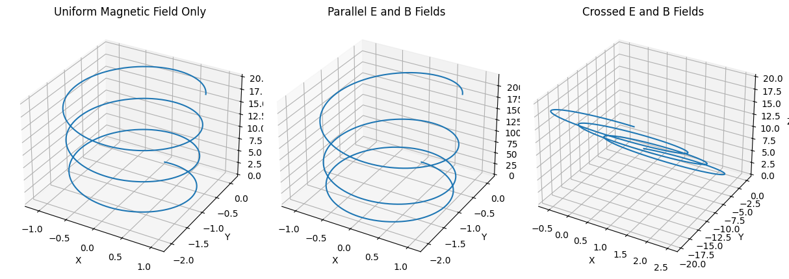

# Problem 1

# Lorentz Force Simulation Project

### Introduction

The motion of charged particles in electromagnetic fields is governed by the Lorentz force, a fundamental principle in classical electrodynamics. This force plays a crucial role in numerous physical systems and technologies, from the design of particle accelerators and mass spectrometers to the containment of plasma in nuclear fusion experiments and the dynamics of cosmic particles in astrophysics.

Understanding the behavior of particles under the influence of electric ($\vec{E}$) and magnetic ($\vec{B}$) fields provides insights into both natural phenomena and engineered systems. Simulations allow us to visualize trajectories that would otherwise be impossible to observe directly, making complex interactions more intuitive. In this project, we simulate various scenarios involving charged particles subjected to electromagnetic fields and analyze their resulting motion.

---

## 1. Exploration of Applications

### Real-World Systems Involving the Lorentz Force

| System                       | Description                                                                            |
| ---------------------------- | -------------------------------------------------------------------------------------- |
| Particle Accelerators        | Magnetic fields bend trajectories; electric fields accelerate particles.               |
| Mass Spectrometers           | Separate ions based on mass-to-charge ratio using $\vec{E}$ and $\vec{B}$.             |
| Plasma Confinement (Tokamak) | Magnetic fields confine plasma to control nuclear fusion reactions.                    |
| Cyclotrons                   | Utilize a perpendicular $\vec{B}$ field and oscillating $\vec{E}$ to spiral particles. |
| Astrophysics                 | Cosmic rays interact with planetary magnetic fields, forming Van Allen belts.          |

### Role of $\vec{E}$ and $\vec{B}$ Fields

- **Electric Field ($\vec{E}$):** Applies a force parallel to the field direction, causing the particle to accelerate or decelerate. This results in a change in the particle's kinetic energy.
- **Magnetic Field ($\vec{B}$):** Exerts a force perpendicular to both the velocity and the magnetic field, leading to circular or helical motion. It alters the direction of motion without doing work.

---

## 2. Simulating Particle Motion

The Lorentz force is given by:

$$
\vec{F} = q(\vec{E} + \vec{v} \times \vec{B})
$$

According to Newton's second law:

$$
\vec{F} = m\frac{d\vec{v}}{dt}
$$

Combining both:

$$
\frac{d\vec{v}}{dt} = \frac{q}{m}(\vec{E} + \vec{v} \times \vec{B})
$$

This forms a system of differential equations that can be solved using numerical techniques such as Euler or Runge-Kutta methods.

### 2.1 Case A: Uniform Magnetic Field Only ($\vec{E} = 0$)

- With no electric field, the particle undergoes circular or helical motion, depending on the initial velocity.
- If $\vec{v} \perp \vec{B}$, the path is circular. If $\vec{v}$ has a component parallel to $\vec{B}$, the result is a helix.

#### Derivation of Larmor Radius:

From centripetal force:

$$
\frac{mv^2}{r} = qvB
$$

Solving for $r$:

$$
\boxed{r_L = \frac{mv}{|q|B}} \quad \text{(Larmor Radius)}
$$

#### Cyclotron Frequency:

$$
\boxed{\omega_c = \frac{|q|B}{m}} \quad \text{(Cyclotron Frequency)}
$$

### 2.2 Case B: Uniform $\vec{E}$ and $\vec{B}$ Fields

- If $\vec{E} \parallel \vec{B}$: Acceleration is linear along the field lines.
- If $\vec{E} \perp \vec{B}$: The particle exhibits drift in the direction perpendicular to both fields.

#### Drift Velocity:

$$
\boxed{\vec{v}_d = \frac{\vec{E} \times \vec{B}}{B^2}}
$$

---

## 3. Parameter Exploration

| Parameter        | Symbol      | Default Value | Description                            |
| ---------------- | ----------- | ------------- | -------------------------------------- |
| Electric Field   | $\vec{E}$   | [0, 0, 0]     | Constant vector field                  |
| Magnetic Field   | $\vec{B}$   | [0, 0, 1]     | Constant vector field                  |
| Initial Velocity | $\vec{v}_0$ | [1, 0, 0]     | Controls type of trajectory            |
| Charge           | $q$         | 1.0           | Can be +ve or -ve (electrons, protons) |
| Mass             | $m$         | 1.0           | Affects radius and frequency           |

By changing these parameters, one can observe transitions from circular to helical motion, increase in drift velocities, and variations in path curvature.

---

## 4. Visualization



We use Python libraries like `NumPy` and `Matplotlib` to plot trajectories. <a href="https://colab.research.google.com/drive/1QrdvAk_rvGMcqpjCHFllfr1AxJhTAB22" target="_blank">Learn more.</a>

```python
import numpy as np
import matplotlib.pyplot as plt
from mpl_toolkits.mplot3d import Axes3D

# Parameters
q, m = 1.0, 1.0
B = np.array([0, 0, 1.0])
E = np.array([0, 0, 0])
v = np.array([1.0, 0.0, 1.0])
r = np.array([0.0, 0.0, 0.0])
dt = 0.01
steps = 2000

positions = []

for _ in range(steps):
    F = q * (E + np.cross(v, B))
    a = F / m
    v += a * dt
    r += v * dt
    positions.append(r.copy())

positions = np.array(positions)
fig = plt.figure()
ax = fig.add_subplot(111, projection='3d')
ax.plot3D(positions[:,0], positions[:,1], positions[:,2])
ax.set_title('Helical Trajectory in Uniform Magnetic Field')
plt.show()
```

### Scenario B: Crossed $\vec{E}$ and $\vec{B}$ Fields

- Expectation: Cyclotron motion superimposed with linear drift.

Modify `E = np.array([1.0, 0.0, 0.0])` and re-run the loop.

---

## 5. Relation to Real Systems

| System         | Observation                                | Related Equation                                     |
|----------------|--------------------------------------------|------------------------------------------------------|
| Cyclotron      | Particles accelerate in spiral paths       | $\omega_c = \dfrac{|q|B}{m}$                         |
| Magnetic Traps | Confines charged particles using $\vec{B}$ | $r_L = \dfrac{mv}{|q|B}$                             |
| Fusion Plasma  | $E \times B$ drift impacts confinement     | $\vec{v}_d = \dfrac{\vec{E} \times \vec{B}}{B^2}$    |

These equations and simulations help design efficient magnetic confinement systems and predict particle behavior in both lab and cosmic environments.


