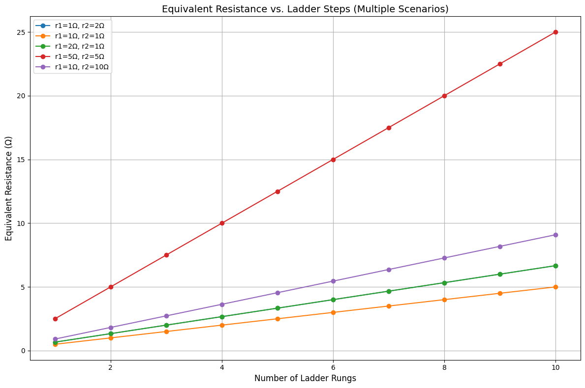

# Problem 1

# Equivalent Resistance Using Graph Theory

## Introduction

Electrical circuits often contain complex arrangements of resistors that make manual analysis using series and parallel reduction tedious. Graph theory provides a robust mathematical framework to model and simplify such networks systematically. Each resistor is modeled as a weighted edge in a graph, and each junction becomes a node. By leveraging traversal algorithms, pattern detection, and graph simplification strategies, we can compute the equivalent resistance of any resistive network.

This approach not only simplifies analysis but also scales well to automated systems, as used in circuit simulation software and optimization tools.

---

## Graph-Theoretic Approach

### Key Concepts

- **Vertices (nodes):** Represent electrical junctions.
- **Edges:** Represent resistors, with weights equal to resistance values.
- **Series Configuration:** A chain of nodes with only two connected edges.
- **Parallel Configuration:** Multiple edges connecting the same pair of nodes.
- **Supernode:** A temporary node formed by merging nodes during reduction.

---

## Algorithm Overview

The algorithm operates iteratively to simplify the graph by reducing identifiable series and parallel subgraphs. It stops when the network is reduced to a single equivalent resistor between the input and output nodes.

### Pseudocode

```text
Function CalculateEquivalentResistance(graph, input_node, output_node):
    While the graph has more than 2 nodes:
        For each node v in graph:
            If v is part of a series chain:
                Replace the chain with a single equivalent resistor
            Else if v connects multiple resistors between same pair of nodes:
                Replace with parallel equivalent resistor

        If no simplifications are found:
            Use Y-Δ transformation or Kirchhoff’s laws

    Return resistance of edge between input_node and output_node
```

---

## Python Implementation (Using NetworkX)

---

## Test Cases

### Example 1: Simple Series

- **Circuit:** A → R1=5Ω → B
- **Expected Result:** 5Ω

```python
import networkx as nx

def parallel_resistance(resistors):
    return 1 / sum(1 / r for r in resistors)

def series_resistance(resistors):
    return sum(resistors)

def simplify_series(graph):
    modified = False
    for node in list(graph.nodes()):
        neighbors = list(graph.neighbors(node))
        if len(neighbors) == 2 and node not in ['A', 'B']:
            u, v = neighbors
            if graph.number_of_edges(u, node) == 1 and graph.number_of_edges(node, v) == 1:
                r1 = graph[u][node]['resistance']
                r2 = graph[node][v]['resistance']
                graph.add_edge(u, v, resistance=r1 + r2)
                graph.remove_node(node)
                modified = True
                break
    return modified

def simplify_parallel(graph):
    modified = False
    for u, v in list(graph.edges()):
        edges = list(graph.get_edge_data(u, v).values())
        if len(edges) > 1:
            resistors = [d['resistance'] for d in edges]
            req = parallel_resistance(resistors)
            graph.remove_edges_from([(u, v)] * len(edges))
            graph.add_edge(u, v, resistance=req)
            modified = True
            break
    return modified

def calculate_equivalent_resistance(graph, input_node, output_node):
    G = graph.copy()
    while simplify_series(G) or simplify_parallel(G):
        pass
    return G[input_node][output_node]['resistance']

G = nx.Graph()
G.add_edge('A', 'B', resistance=5)
print(calculate_equivalent_resistance(G, 'A', 'B'))  # Output: 5
```

---

### Example 2: Parallel Combination

- **Circuit:** A → R1=6Ω // R2=3Ω → B
- **Expected:**  
   \( R\_{eq} = \left(rac{1}{6} + rac{1}{3}
  ight)^{-1} = 2 \Omega \)

```python
import networkx as nx

def parallel_resistance(resistors):
    return 1 / sum(1 / r for r in resistors)

def series_resistance(resistors):
    return sum(resistors)

def simplify_series(graph):
    modified = False
    for node in list(graph.nodes()):
        neighbors = list(graph.neighbors(node))
        if len(neighbors) == 2 and node not in ['A', 'B']:
            u, v = neighbors
            if graph.number_of_edges(u, node) == 1 and graph.number_of_edges(node, v) == 1:
                r1 = list(graph.get_edge_data(u, node).values())[0]['resistance']
                r2 = list(graph.get_edge_data(node, v).values())[0]['resistance']
                graph.add_edge(u, v, resistance=r1 + r2)
                graph.remove_node(node)
                modified = True
                break
    return modified

def simplify_parallel(graph):
    modified = False
    for u, v in list(graph.edges()):
        edge_data = graph.get_edge_data(u, v)
        if edge_data and len(edge_data) > 1:
            resistors = [d['resistance'] for d in edge_data.values()]
            req = parallel_resistance(resistors)
            keys = list(edge_data.keys())
            for k in keys:
                graph.remove_edge(u, v, key=k)
            graph.add_edge(u, v, resistance=req)
            modified = True
            break
    return modified

def calculate_equivalent_resistance(graph, input_node, output_node):
    G = graph.copy()
    while simplify_series(G) or simplify_parallel(G):
        pass
    return G[input_node][output_node][0]['resistance']  # Key is 0 after simplification

G = nx.MultiGraph()
G.add_edge('A', 'B', resistance=6)
G.add_edge('A', 'B', resistance=3)

print(calculate_equivalent_resistance(G, 'A', 'B'))  # Output: 2.0
```

---

### Example 3: Nested Configuration

- **Circuit:**

  ```
  A - R1(2Ω) - C - R2(4Ω) - B
         \             /
         R3(6Ω) ------
  ```

- **Step 1:** R2 and R3 are in parallel:  
   \( R\_{23} = \left(rac{1}{4} + rac{1}{6}
  ight)^{-1} = 2.4 \Omega \)

- **Step 2:** R1 and R*{23} in series:  
  \( R*{eq} = 2 + 2.4 = 4.4 \Omega \)

```python
import networkx as nx

def parallel_resistance(resistors):
    return 1 / sum(1 / r for r in resistors)

def series_resistance(resistors):
    return sum(resistors)

def simplify_series(graph):
    modified = False
    for node in list(graph.nodes()):
        neighbors = list(graph.neighbors(node))
        if len(neighbors) == 2 and node not in ['A', 'B']:
            u, v = neighbors
            if graph.number_of_edges(u, node) == 1 and graph.number_of_edges(node, v) == 1:
                r1 = list(graph.get_edge_data(u, node).values())[0]['resistance']
                r2 = list(graph.get_edge_data(node, v).values())[0]['resistance']
                graph.add_edge(u, v, resistance=r1 + r2)
                graph.remove_node(node)
                modified = True
                break
    return modified

def simplify_parallel(graph):
    modified = False
    for u, v in list(graph.edges()):
        edge_data = graph.get_edge_data(u, v)
        if edge_data and len(edge_data) > 1:
            resistors = [d['resistance'] for d in edge_data.values()]
            req = parallel_resistance(resistors)
            keys = list(edge_data.keys())
            for k in keys:
                graph.remove_edge(u, v, key=k)
            graph.add_edge(u, v, resistance=req)
            modified = True
            break
    return modified

def calculate_equivalent_resistance(graph, input_node, output_node):
    G = graph.copy()
    while simplify_series(G) or simplify_parallel(G):
        pass
    return G[input_node][output_node][0]['resistance']  # Key is 0 after simplification

G = nx.MultiGraph()
G.add_edge('A', 'C', resistance=2)
G.add_edge('C', 'B', resistance=4)
G.add_edge('C', 'B', resistance=6)
print(calculate_equivalent_resistance(G, 'A', 'B'))  # Output: 4.4
```

---

## Plotting Resistance vs. Node Count

Let’s visualize how equivalent resistance evolves in a ladder network. <a href="https://colab.research.google.com/drive/1NJXC4JYxTBp6Lzhj9QoSDNdsLoz4mmBo" target="_blank">Learn more</a>:



```python
import matplotlib.pyplot as plt
from matplotlib.pyplot import figure
import networkx as nx

def parallel_resistance(resistors):
    return 1 / sum(1 / r for r in resistors)

def series_resistance(resistors):
    return sum(resistors)

def simplify_series(graph, input_node, output_node):
    modified = False
    for node in list(graph.nodes()):
        if node in [input_node, output_node]:
            continue
        neighbors = list(graph.neighbors(node))
        if len(neighbors) == 2:
            u, v = neighbors
            if graph.number_of_edges(u, node) == 1 and graph.number_of_edges(node, v) == 1:
                r1 = list(graph.get_edge_data(u, node).values())[0]['resistance']
                r2 = list(graph.get_edge_data(node, v).values())[0]['resistance']
                graph.add_edge(u, v, resistance=r1 + r2)
                graph.remove_node(node)
                modified = True
                break
    return modified

def simplify_parallel(graph):
    modified = False
    for u, v in list(graph.edges()):
        edge_data = graph.get_edge_data(u, v)
        if edge_data and len(edge_data) > 1:
            resistors = [d['resistance'] for d in edge_data.values()]
            req = parallel_resistance(resistors)
            keys = list(edge_data.keys())
            for k in keys:
                graph.remove_edge(u, v, key=k)
            graph.add_edge(u, v, resistance=req)
            modified = True
            break
    return modified

def calculate_equivalent_resistance(graph, input_node, output_node):
    G = graph.copy()
    while simplify_series(G, input_node, output_node) or simplify_parallel(G):
        pass
    return G[input_node][output_node][0]['resistance']

def build_ladder(n, r1=1, r2=2):
    G = nx.MultiGraph()
    for i in range(n):
        G.add_edge(f'N{i}', f'N{i+1}', resistance=r1)
        G.add_edge(f'N{i}', f'N{i+1}', resistance=r2)
    return G

# Ladder sizes
nodes = range(1, 11)

# Define scenarios: (label, r1, r2)
scenarios = [
    ("r1=1Ω, r2=2Ω", 1, 2),
    ("r1=1Ω, r2=1Ω", 1, 1),
    ("r1=2Ω, r2=1Ω", 2, 1),
    ("r1=5Ω, r2=5Ω", 5, 5),
    ("r1=1Ω, r2=10Ω", 1, 10)
]

# Plot setup
figure(figsize=(12, 8))
for label, r1, r2 in scenarios:
    resistances = []
    for n in nodes:
        G = build_ladder(n, r1, r2)
        input_node = 'N0'
        output_node = f'N{n}'
        R_eq = calculate_equivalent_resistance(G, input_node, output_node)
        resistances.append(R_eq)
    plt.plot(nodes, resistances, marker='o', label=label)

# Labels and legend
plt.title('Equivalent Resistance vs. Ladder Steps (Multiple Scenarios)', fontsize=14)
plt.xlabel('Number of Ladder Rungs', fontsize=12)
plt.ylabel('Equivalent Resistance (Ω)', fontsize=12)
plt.legend()
plt.grid(True)
plt.tight_layout()
plt.show()
```

---

## Efficiency Analysis

| Operation              | Time Complexity         |
| ---------------------- | ----------------------- |
| Series Detection       | \( O(n) \)              |
| Parallel Detection     | \( O(n^2) \)            |
| Overall Simplification | \( O(n^2) \) worst-case |

- **Space Complexity:** \( O(n + m) \)  
  where \( n \) is number of nodes and \( m \) is number of edges.

---

## Limitations

- Cannot yet handle **Delta-Wye** (Δ-Y) transformations.
- May get stuck if no identifiable series or parallel patterns are found.
- Not optimized for **dense cyclic** graphs.

---

## Improvements and Extensions

- Add **Y-Δ transformations** for full topology support.
- Implement **Kirchhoff's Matrix Methods** using node-voltage analysis.
- Extend for **AC circuits** using complex impedances.
- Improve with symbolic computation (e.g., SymPy) for algebraic analysis.

---

## Conclusion

Graph theory offers an elegant and scalable way to analyze resistive circuits. By iteratively detecting and reducing series and parallel configurations, we can compute equivalent resistance for even complex networks. This method supports automation, generalization, and integration with modern simulation tools, making it invaluable in education, research, and engineering design.

---
