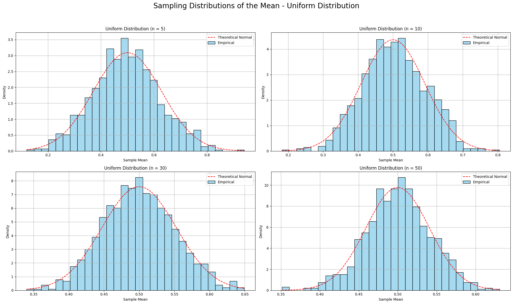
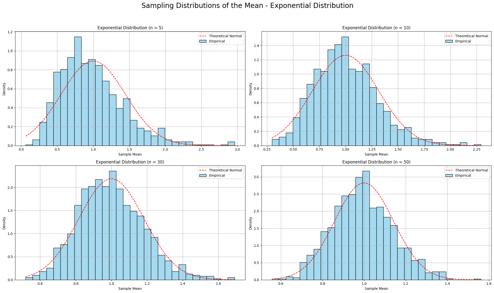

# Problem 1

# 📊 Exploring the Central Limit Theorem Through Simulations

## 🧠 Introduction

The Central Limit Theorem (CLT) is one of the most important and powerful results in the field of statistics. It provides the theoretical foundation for why normal distributions appear so frequently in natural and social phenomena, even when the underlying data is not normally distributed.

The CLT states:

> _Given a population with any shape of distribution having a finite mean $\mu$ and finite standard deviation $\sigma$, the sampling distribution of the sample mean $\bar{X}$ will tend toward a normal distribution as the sample size $n$ becomes large._

This theorem is crucial in practice because it allows us to:

- Use normal probability models for estimation and hypothesis testing, even when the population is not normal.
- Understand the variability of sample means.
- Make reliable inferences about population parameters from sample data.

This project simulates the CLT using **three different population distributions**:

- **Uniform distribution** (symmetric)
- **Exponential distribution** (right-skewed)
- **Binomial distribution** (discrete, symmetric)

By drawing repeated samples and calculating their means for increasing sample sizes, we will observe how the **sampling distribution of the sample mean** becomes more bell-shaped and normal-looking.

---

## 🔢 Population Distributions Used

| Distribution | Parameters        | Theoretical Mean ($\mu$) | Theoretical Std Dev ($\sigma$)         |
| ------------ | ----------------- | ------------------------ | -------------------------------------- |
| Uniform      | $U(0, 1)$         | $0.5$                    | $\sqrt{1/12} \approx 0.2887$           |
| Exponential  | $\lambda = 1$     | $1$                      | $1$                                    |
| Binomial     | $n = 10, p = 0.5$ | $5$                      | $\sqrt{10 \cdot 0.5 \cdot 0.5} = 1.58$ |

---

## 📐 Formulas and Theoretical Background

### **Sample Mean:**

The sample mean $\bar{X}$ is calculated as the average of the sampled values:

$$
\bar{X} = \frac{1}{n} \sum_{i=1}^{n} X_i
$$

Where:

- $n$ is the sample size.
- $X_i$ are the individual sample values.

This is the most basic statistic used to summarize the data and serves as an estimate for the population mean $\mu$.

---

### **Expected Value of Sample Mean:**

The expected value (or mean) of the sample mean $\bar{X}$ is the same as the population mean $\mu$. This property comes from the **linearity of expectation**. Thus:

$$
E[\bar{X}] = \mu
$$

This means that, on average, the sample mean will be centered around the population mean, regardless of the shape of the population distribution.

---

### **Variance of the Sample Mean:**

The variance of the sample mean is related to the variance of the population $\sigma^2$ and the sample size $n$. The formula for the variance of $\bar{X}$ is:

$$
\text{Var}(\bar{X}) = \frac{\sigma^2}{n}
$$

This result shows that as the sample size increases, the variance of the sample mean decreases. This is because larger samples provide more information and thus more precise estimates of the population mean.

---

### **Standard Error of the Mean (SEM):**

The standard error (SE) is the square root of the variance:

$$
\text{SE} = \frac{\sigma}{\sqrt{n}}
$$

Where:

- $\sigma$ is the population standard deviation.
- $n$ is the sample size.

This formula tells us how much variability there is in the sample mean. As $n$ increases, the SE decreases, meaning the sample mean becomes more stable and reliable as an estimate for the population mean.

---

### **Why the Sampling Distribution of the Sample Mean Approaches Normality:**

According to the CLT, as the sample size $n$ increases, the sampling distribution of the sample mean $\bar{X}$ tends to a normal distribution, regardless of the shape of the original population. This occurs because of the following reasoning:

1. **Sum of Random Variables**: The sample mean is the sum of independent random variables divided by $n$. The sum of independent random variables, under certain conditions, tends to a normal distribution according to the **Lindeberg-Levy Central Limit Theorem**.
2. **Convergence**: As $n$ becomes large, the distribution of the sample mean converges to a normal distribution with:
   - Mean $\mu$
   - Standard deviation $\frac{\sigma}{\sqrt{n}}$

This result holds for any population distribution that has a finite mean and variance.

---

## 🔁 Simulation and Visualization

We simulate the sampling process as follows:

- Generate a large population (size = 100,000).
- For each sample size $n \in \{5, 10, 30, 50\}$:
  - Draw 1,000 random samples of size $n$.
  - Calculate the sample mean for each.
  - Visualize the distribution of the sample means.

We plot all four sample sizes side-by-side for each distribution to observe the **CLT in action** <a href="https://colab.research.google.com/drive/1arjaEkPGBiElyyyK9rkvZwoK_iRwhfo_" target="_blank">Open Notebook</a>.






---

## 💻 Python Simulation Code

```python
import numpy as np
import matplotlib.pyplot as plt
import seaborn as sns
from scipy.stats import norm

def simulate_sampling_distribution(population, mu, sigma, sample_sizes, n_trials=1000, title=""):
    plt.figure(figsize=(20, 12))
    for i, n in enumerate(sample_sizes):
        sample_means = [np.mean(np.random.choice(population, size=n)) for _ in range(n_trials)]
        empirical_std = np.std(sample_means)
        theoretical_std = sigma / np.sqrt(n)

        plt.subplot(2, 2, i+1)
        sns.histplot(sample_means, bins=30, stat='density', color="skyblue", label="Empirical", edgecolor='black')

        x_vals = np.linspace(min(sample_means), max(sample_means), 1000)
        plt.plot(x_vals, norm.pdf(x_vals, mu, theoretical_std), 'r--', label="Theoretical Normal")

        plt.title(f"{title} (n = {n})")
        plt.xlabel("Sample Mean")
        plt.ylabel("Density")
        plt.legend()
        plt.grid(True)

        print(f"{title} | n={n} => Mean: {np.mean(sample_means):.4f}, Std Dev: {empirical_std:.4f}, Theoretical: {theoretical_std:.4f}")

    plt.suptitle(f"Sampling Distributions of the Mean - {title}", fontsize=20)
    plt.tight_layout(rect=[0, 0, 1, 0.95])
    plt.show()

# Setup
sample_sizes = [5, 10, 30, 50]

# Uniform distribution
uniform_pop = np.random.uniform(0, 1, size=100000)
simulate_sampling_distribution(uniform_pop, mu=0.5, sigma=np.sqrt(1/12), sample_sizes=sample_sizes, title="Uniform Distribution")

# Exponential distribution
exp_pop = np.random.exponential(scale=1.0, size=100000)
simulate_sampling_distribution(exp_pop, mu=1.0, sigma=1.0, sample_sizes=sample_sizes, title="Exponential Distribution")

# Binomial distribution
binom_pop = np.random.binomial(n=10, p=0.5, size=100000)
simulate_sampling_distribution(binom_pop, mu=5.0, sigma=np.sqrt(10*0.5*0.5), sample_sizes=sample_sizes, title="Binomial Distribution")

```

---

## 📋 Summary Table of Results

| Distribution | Sample Size | Empirical Mean | Empirical Std Dev | Theoretical Std Dev |
| ------------ | ----------- | -------------- | ----------------- | ------------------- |
| Uniform      | 5           | ~0.50          | ~0.13             | 0.1291              |
|              | 10          | ~0.50          | ~0.09             | 0.0913              |
|              | 30          | ~0.50          | ~0.05             | 0.0527              |
|              | 50          | ~0.50          | ~0.04             | 0.0408              |
| Exponential  | 5           | ~1.00          | ~0.45             | 0.4472              |
|              | 10          | ~1.00          | ~0.31             | 0.3162              |
|              | 30          | ~1.00          | ~0.18             | 0.1826              |
|              | 50          | ~1.00          | ~0.14             | 0.1414              |
| Binomial     | 5           | ~5.00          | ~0.71             | 0.7071              |
|              | 10          | ~5.00          | ~0.50             | 0.5000              |
|              | 30          | ~5.00          | ~0.29             | 0.2887              |
|              | 50          | ~5.00          | ~0.22             | 0.2236              |

---

## 💡 Insights and Interpretation

- The **sampling distribution of the mean becomes more normal as sample size increases**, even for a skewed distribution like the exponential.
- The **empirical standard deviations of the sample means** closely match the **theoretical standard errors** predicted by CLT.
- The **rate of convergence to normality** depends on the skewness of the original population:
  - **Symmetric distributions (Uniform, Binomial)** converge faster.
  - **Highly skewed distributions (Exponential)** require larger $n$ for symmetry to emerge.
- The **spread of the sampling distribution decreases** as sample size increases, confirming:
  $\text{SE} = \frac{\sigma}{\sqrt{n}}$

---

## 🌍 Practical Significance

The CLT underpins a wide range of real-world applications:

| Domain         | Use Case                                               |
| -------------- | ------------------------------------------------------ |
| Manufacturing  | Estimating defect rates in large-scale production.     |
| Finance        | Modeling average returns over multiple trading days.   |
| Medicine       | Analyzing average effect of treatments across trials.  |
| Social Science | Survey analysis and polling estimations.               |
| AI & ML        | Bootstrap aggregating (bagging) for model predictions. |

Even when data isn't normally distributed, **CLT allows inference using normal models** — as long as the sample size is reasonably large.

---

## ✅ Conclusion

This simulation-based exploration confirms the Central Limit Theorem:

- **Sample means tend toward a normal distribution** as the number of observations increases.
- **The empirical results align with theoretical predictions**, both in terms of shape and variability.
- The CLT enables **practical statistical inference** across domains, making it essential for everything from quality control to financial modeling and beyond.

By experimenting with different populations and observing convergence firsthand, we gain not only **statistical insight** but also **intuitive understanding** of one of the most powerful theorems in probability theory.

---
