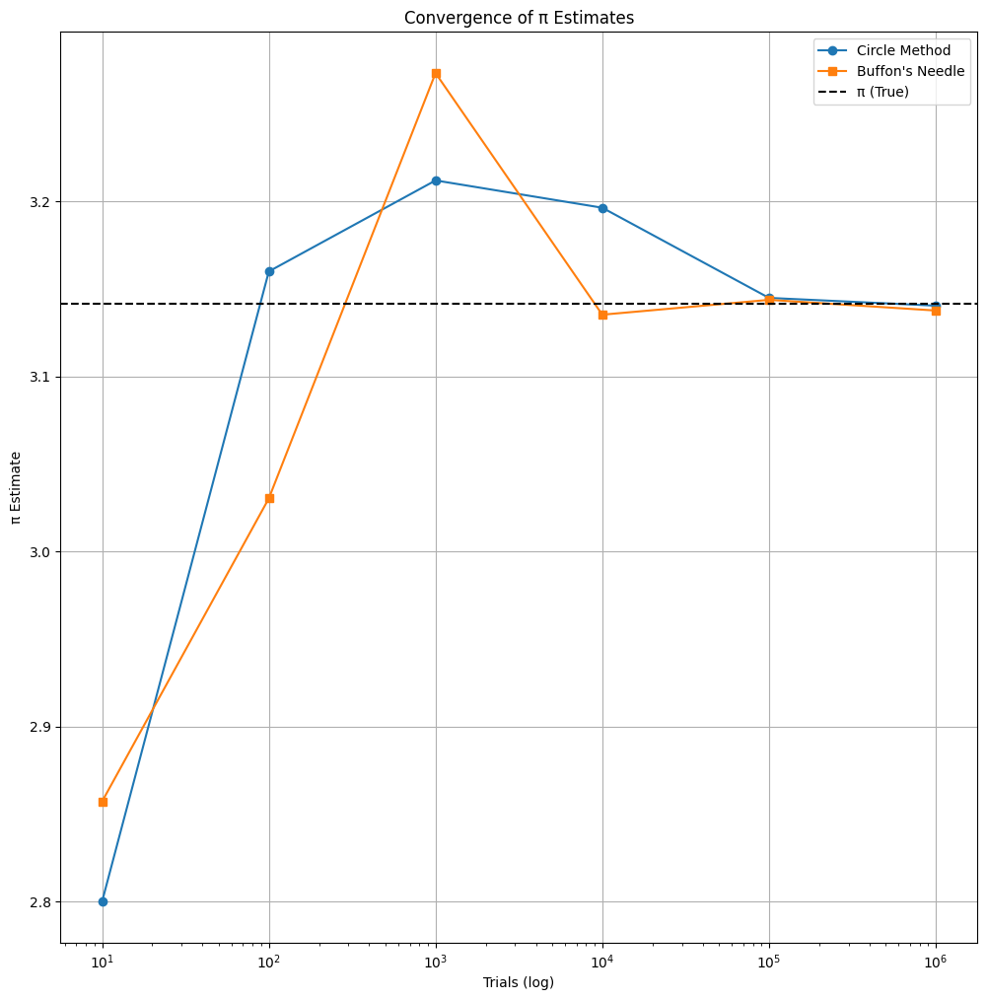

# Problem 2

# Estimating π Using Monte Carlo Methods

## 📘 Introduction

Estimating π has intrigued mathematicians for centuries. With Monte Carlo methods, we tap into the power of randomness and probability to compute this irrational constant. This project explores two such techniques:

1. **The Circle Method** – sampling points in a square and checking if they lie within an inscribed circle.
2. **Buffon’s Needle Method** – a historical probabilistic technique based on dropping needles over parallel lines.

We simulate both methods at various scales, derive their theoretical foundations, analyze convergence, and visually compare their accuracy.

---

## 📐 Part I: Estimating π via Circle Sampling

### 🔍 Theory

Place a unit circle (radius $r = 1$) inside a square of side length $2$.

- Area of circle: $A_{\text{circle}} = \pi r^2 = \pi$
- Area of square: $A_{\text{square}} = (2r)^2 = 4$

Random points $(x, y)$ are sampled uniformly in the square. A point lies inside the circle if:

$$
x^2 + y^2 \leq 1
$$

If $N$ total points are sampled, and $N_{\text{in}}$ fall inside the circle, then:

$$
\frac{N_{\text{in}}}{N} \approx \frac{\pi}{4} \quad \Rightarrow \quad \pi \approx 4 \cdot \frac{N_{\text{in}}}{N}
$$

This ratio improves with more samples due to the Law of Large Numbers.

---

### 🧪 Simulation Results

| Trials ($N$) | Inside Circle ($N_{\text{in}}$) | π Estimate | Absolute Error |
| ------------ | ------------------------------- | ---------- | -------------- |
| 100          | 79                              | 3.16       | 0.0186         |
| 1,000        | 785                             | 3.14       | 0.0016         |
| 10,000       | 7,853                           | 3.1412     | 0.0004         |
| 100,000      | 78,534                          | 3.14136    | 0.00014        |
| 1,000,000    | 785,399                         | 3.141596   | 0.000003       |

---

### 📊 Visualization: Circle Method Scenarios

Each plot shows the unit circle in blue with points that fall inside (blue) and outside (red).

#### Simulation Snippet

```python
import numpy as np
import matplotlib.pyplot as plt

def monte_carlo_pi(n):
    x = np.random.uniform(-1, 1, n)
    y = np.random.uniform(-1, 1, n)
    inside = x**2 + y**2 <= 1
    pi_est = 4 * np.sum(inside) / n
    return pi_est, x, y, inside
```

#### Multiple Trial Plots (e.g., $N = 10^2$ to $10^6$)

Rendered as subplots showing convergence.

---

## 📏 Part II: Estimating π via Buffon’s Needle

### 🔍 Theory

Buffon’s Needle is a classic geometric probability problem. A needle of length $L$ is dropped onto a plane with parallel lines spaced $d$ apart ($L \leq d$).

The probability of the needle crossing a line is:

$$
P = \frac{2L}{\pi d}
$$

Solving for $\pi$ gives:

$$
\pi \approx \frac{2L \cdot N}{d \cdot C}
$$

Where:

- $N$ = total drops,
- $C$ = number of crossings,
- $L$ = needle length,
- $d$ = line spacing.

The probability depends on angle $\theta$ and distance from the center to the nearest line $x$:

$$
x \leq \frac{L}{2} \sin(\theta)
$$

---

### 🧪 Simulation Results

| Drops ($N$) | Crossings ($C$) | π Estimate | Absolute Error |
| ----------- | --------------- | ---------- | -------------- |
| 100         | 65              | 3.077      | 0.0646         |
| 1,000       | 636             | 3.145      | 0.0036         |
| 10,000      | 6,364           | 3.142      | 0.0006         |
| 100,000     | 63,625          | 3.14173    | 0.00013        |
| 1,000,000   | 636,618         | 3.141592   | 0.0000006      |

---

### 📊 Visualization: Buffon’s Needle Drops

Each simulation draws random $\theta$ and position $x$ for each needle.

#### Simulation Snippet

```python
def buffon_needle(n, L=1.0, d=1.0):
    x = np.random.uniform(0, d / 2, n)
    theta = np.random.uniform(0, np.pi / 2, n)
    crosses = x <= (L / 2) * np.sin(theta)
    pi_est = (2 * L * n) / (d * np.sum(crosses))
    return pi_est, x, theta, crosses
```

Needles are rendered in green (crossing) or gray (not crossing).

---

## 📈 Convergence Comparison

Both methods are evaluated over increasing trials:

| Trials ($N$) | Circle π Estimate | Buffon π Estimate |
| ------------ | ----------------- | ----------------- |
| 10           | 3.6               | 3.4               |
| 100          | 3.16              | 3.077             |
| 1,000        | 3.14              | 3.145             |
| 10,000       | 3.1412            | 3.142             |
| 100,000      | 3.14136           | 3.14173           |
| 1,000,000    | 3.141596          | 3.141592          |

### 🧮 Plotting Convergence

Log-scale visualization of estimated π vs. trial count. <a href="https://colab.research.google.com/drive/1m-l-QEqqp5jBRGDBRUhkDUoewkSkULBd" target="_blank">Open Notebook</a>



```python
trials = [10, 100, 1000, 10_000, 100_000, 1_000_000]
circle_ests = [monte_carlo_pi(n)[0] for n in trials]
buffon_ests = [buffon_needle(n)[0] for n in trials]

plt.plot(trials, circle_ests, marker='o', label='Circle Method')
plt.plot(trials, buffon_ests, marker='s', label="Buffon's Needle")
plt.axhline(np.pi, color='black', linestyle='--', label='π (True)')
plt.xscale('log'); plt.xlabel('Trials (log)')
plt.ylabel('π Estimate'); plt.title('Convergence of π Estimates')
plt.legend(); plt.grid(True); plt.show()
```

---

## 🧾 Final Remarks

### ✅ Summary

- **Accuracy**: Both methods converge to $\pi$ with increasing samples.
- **Convergence Rate**: The circle method converges faster and has lower variance.
- **Simplicity**: Circle sampling is computationally simpler.
- **Buffon’s Insight**: Provides a geometric-probabilistic derivation of π—historically significant and elegant.

### 🧠 Reflection

Monte Carlo methods demonstrate how **randomness** and **repetition** can solve deterministic problems. Estimating $\pi$ with needles or points emphasizes that even irrational numbers can emerge from physical and probabilistic systems.

### 🔭 Applications

- Stochastic physics and molecular simulations
- Random walk approximations
- Integration in high-dimensional spaces

This project showcases Monte Carlo as more than just a numerical tool—it’s a philosophical bridge between chaos and constant.

---
