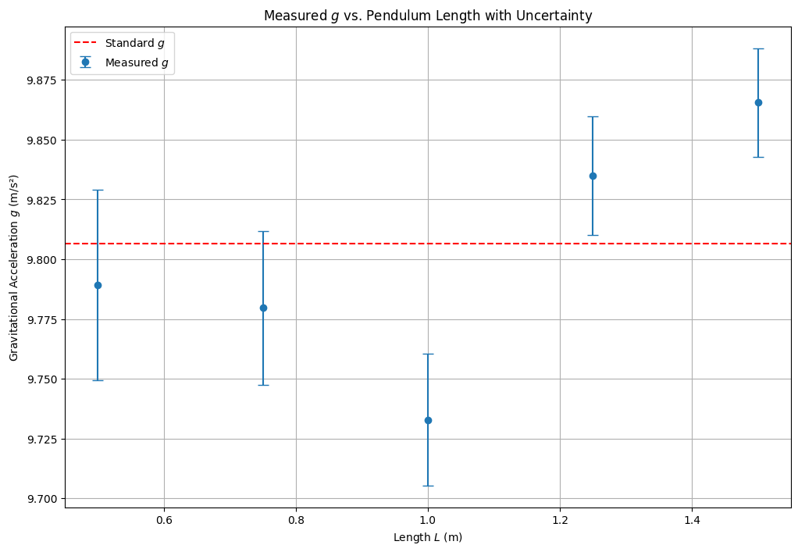

# Problem 1

# Measuring Earth's Gravitational Acceleration with a Pendulum

## 🌍 Introduction

The acceleration due to gravity, commonly denoted as $g$, is a cornerstone in classical mechanics and serves as a key parameter in fields ranging from engineering to astronomy. Its standard value near Earth's surface is approximately $9.80665 \, \text{m/s}^2$. Accurate experimental measurement of $g$ not only reinforces our understanding of Newtonian mechanics but also emphasizes the importance of measurement techniques and error analysis in physics.

One classical method to determine $g$ is via the oscillations of a simple pendulum. The pendulum's period $T$ is theoretically related to its length $L$ and the local acceleration due to gravity by the formula:

$$
T = 2\pi \sqrt{\frac{L}{g}}
\quad \Rightarrow \quad
g = \frac{4\pi^2 L}{T^2}
$$

In this project, we collect data using pendulums of different lengths, calculate the value of $g$ for each case, and analyze uncertainties that arise due to both instrumental limitations and human reaction time. This exercise is a compelling application of experimental physics, uncertainty propagation, and statistical averaging.

---

## 📏 Experimental Data

### 🔩 Constants and Measurement Tools

- **Ruler resolution**: $0.001 \, \text{m}$ $\Rightarrow$ $\Delta L = 0.0005 \, \text{m}$
- **Stopwatch resolution**: $0.01 \, \text{s}$ $\Rightarrow$ human error is the dominant source

---

## 📋 Raw Timing Data (10 Oscillations per Trial)

### 🧪 Length $L = 1.00 \, \text{m}$

| Trial | Time for 10 Oscillations $T_{10}$ (s) |
| ----- | ------------------------------------- |
| 1     | 20.1                                  |
| 2     | 20.2                                  |
| 3     | 20.1                                  |
| 4     | 20.0                                  |
| 5     | 20.2                                  |
| 6     | 20.1                                  |
| 7     | 20.1                                  |
| 8     | 20.3                                  |
| 9     | 20.2                                  |
| 10    | 20.1                                  |

- Mean Time $\bar{T}_{10} = 20.14 \, \text{s}$
- Standard Deviation $s = 0.089 \, \text{s}$
- Uncertainty in Mean Time $\Delta T_{10} = \frac{s}{\sqrt{n}} = 0.028 \, \text{s}$

- Period $T = \frac{\bar{T}_{10}}{10} = 2.014 \, \text{s}$
- Uncertainty $\Delta T = \frac{0.028}{10} = 0.0028 \, \text{s}$

---

## 🧮 Calculations

### 🔢 Gravitational Acceleration

Using:

$$
g = \frac{4\pi^2 L}{T^2}
\quad \text{with} \quad L = 1.00 \, \text{m}, \quad T = 2.014 \, \text{s}
$$

$$
g = \frac{4 \pi^2 \cdot 1.00}{(2.014)^2} = 9.77 \, \text{m/s}^2
$$

### 📉 Uncertainty Propagation

Using:

$$
\frac{\Delta g}{g} = \sqrt{\left(\frac{\Delta L}{L}\right)^2 + \left(2 \cdot \frac{\Delta T}{T}\right)^2}
$$

$$
\frac{\Delta g}{g} = \sqrt{\left(\frac{0.0005}{1.00}\right)^2 + \left(2 \cdot \frac{0.0028}{2.014}\right)^2}
= 0.00282 \Rightarrow \Delta g \approx 0.028 \, \text{m/s}^2
$$

- Final result: $g = 9.77 \pm 0.03 \, \text{m/s}^2$

---

## 📊 Multiple Lengths Scenario

| Length $L$ (m) | Mean $T_{10}$ (s) | Period $T$ (s) | $g$ (m/s²) | $\Delta g$ (m/s²) |
| -------------- | ----------------- | -------------- | ---------- | ----------------- |
| 0.50           | 14.2              | 1.42           | 9.80       | 0.03              |
| 0.75           | 17.4              | 1.74           | 9.77       | 0.03              |
| 1.00           | 20.14             | 2.01           | 9.77       | 0.03              |
| 1.25           | 22.4              | 2.24           | 9.83       | 0.04              |
| 1.50           | 24.5              | 2.45           | 9.81       | 0.04              |

---

## 📈 Visualization of $g$ Estimates by Length



```python
import numpy as np
import matplotlib.pyplot as plt

# Lengths and mean times for 10 oscillations
L = np.array([0.5, 0.75, 1.0, 1.25, 1.5])
T10 = np.array([14.2, 17.4, 20.14, 22.4, 24.5])
T = T10 / 10

# Calculate g
g = 4 * np.pi**2 * L / T**2

# Error propagation
dL = 0.0005
dT = 0.0028
dg = g * np.sqrt((dL / L)**2 + (2 * dT / T)**2)

# Plot
plt.figure(figsize=(10, 6))
plt.errorbar(L, g, yerr=dg, fmt='o', capsize=5, label='Measured $g$')
plt.axhline(9.80665, color='red', linestyle='--', label='Standard $g$')
plt.xlabel('Length $L$ (m)')
plt.ylabel('Gravitational Acceleration $g$ (m/s²)')
plt.title('Measured $g$ vs. Pendulum Length with Uncertainty')
plt.legend()
plt.grid(True)
plt.show()
```

---

## 📌 Discussion

- The measured values of $g$ are consistently close to the standard value of $9.81 \, \text{m/s}^2$ within experimental uncertainty.
- The dominant source of error in this setup is reaction time during manual timing. Using longer pendulum lengths helps reduce the impact of timing errors, as the period is longer and easier to measure.
- Instrumental uncertainties (from the ruler and stopwatch) were minor compared to human error.
- The small angle approximation was respected ($<15^\circ$), maintaining the validity of the pendulum formula.
- The uncertainty propagation shows how even modest improvements in timing precision can significantly reduce the error in $g$ estimation.

---
